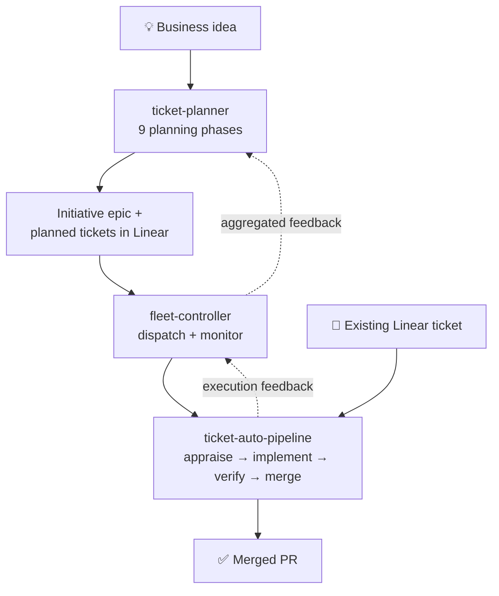

# willard-pro/claude-plugins

Claude Code plugin marketplace — an autonomous ticket pipeline that takes work from *business idea* to *merged pull request*, plus the tooling around it.

**New here?** Read [Which plugin do I need?](#which-plugin-do-i-need), then follow [Getting started](#getting-started) and [Your first run](#your-first-run).

---

## What's here

Four installable plugins. Install only what you need — they work standalone and compose when combined.

| Plugin | Version | What it does |
|--------|---------|--------------|
| [`ticket-auto-pipeline`](ticket-auto-pipeline/README.md) | 0.39.0 | **The core.** Takes a Linear ticket and appraises, implements, verifies, and merges it with zero user input. 20+ slash commands, state-machine flow control, deterministic safety gates. |
| [`ticket-planner`](ticket-planner/README.md) | 0.8.25 | **Upstream of the core.** Turns a one-sentence business idea into dependency-ordered, ready-to-execute tickets across 9 planning phases. Supports grill-me validated intent files as optional pre-flight gate. |
| [`fleet-controller`](fleet-controller/README.md) | 0.22.0 | **Above the core.** Dispatches planned tickets, monitors every running pipeline via 14 detection engines, kills and restarts stuck runs, feeds results back to the planner. Bash-only. |
| [`knowledge-curator`](knowledge-curator/README.md) | 0.2.0 | **Beside the core.** Durable cross-project knowledge tracking — captures ideas, decisions, and lessons, then resurfaces them when relevant. |
| [`grill-me`](grill-me/README.md) | 0.1.1 | **Before the core.** Pre-work readiness gate — assesses ideas against profile-driven dimensions, asks ranked clarification questions, and produces cryptographically sealed Validated Business Intent documents. |

---

## Which plugin do I need?

| Your goal | Install | Then run |
|-----------|---------|----------|
| "I have a Linear ticket. Implement it for me." | `ticket-auto-pipeline` | `/ticket-auto CRE-47` |
| "I have an idea. Break it into tickets for me." | `ticket-planner` + `ticket-auto-pipeline` | `/ticket-planner plan "..."` |
| "I have an idea — but is it ready to plan?" | `grill-me` | `/grill-me "..."` |
| "Run many tickets at once, unattended, and recover from failures." | all three above | `/fleet-controller monitor` |
| "Remember decisions and lessons across my projects." | `knowledge-curator` | Nothing — it's hook-driven |

**Most people start with `ticket-auto-pipeline` alone**, run a few tickets by hand, and add the planner and fleet controller once they trust it.

> `ticket-planner` and `fleet-controller` both depend on libraries from `ticket-auto-pipeline`. Install it whenever you install either of them.

---

## How it fits together



Each layer is independently usable. The dotted lines are the feedback ring: what actually happened during execution flows back so the planner can re-plan.

**Determinism boundary** — the design rule that runs through every plugin: *bash orchestrates, Claude reasons.* State parsing, phase routing, gate decisions, and every Linear mutation are deterministic bash. Investigation, implementation, and review are Claude agents. No LLM ever decides a state transition.

---

## Getting started

### 1. Install

```bash
# Add this marketplace (one-time)
claude plugin marketplace add willard-pro/claude-plugins

# Install the core pipeline
claude plugin install ticket-auto-pipeline@willard-pro-claude-plugins
```

Add the others as needed:

```bash
claude plugin install ticket-planner@willard-pro-claude-plugins
claude plugin install fleet-controller@willard-pro-claude-plugins
claude plugin install knowledge-curator@willard-pro-claude-plugins
```

### 2. Set credentials

In `~/.claude/settings.local.json`:

```json
{
  "env": {
    "LINEAR_API_KEY": "lin_api_...",
    "GITHUB_PERSONAL_ACCESS_TOKEN": "ghp_...",
    "ANTHROPIC_AUTH_TOKEN": "sk-ant-..."
  }
}
```

| Variable | Purpose | Where to get it |
|----------|---------|-----------------|
| `LINEAR_API_KEY` | Linear ticket reads and mutations | Linear → Settings → API |
| `GITHUB_PERSONAL_ACCESS_TOKEN` (or `GH_TOKEN`) | PR creation and review | GitHub → Settings → Developer settings → Tokens (`repo`, `pull_requests` scopes) |
| `ANTHROPIC_AUTH_TOKEN` | Claude API access | console.anthropic.com |

Full optional-variable reference: [ticket-auto-pipeline README → Required Environment](ticket-auto-pipeline/README.md#required-environment).

### 3. Configure MCP servers

The pipeline needs three MCP servers in `~/.claude.json`:

```json
{
  "mcpServers": {
    "linear-server": {
      "command": "npx",
      "args": ["-y", "@linear/mcp-server"],
      "env": { "LINEAR_API_KEY": "${LINEAR_API_KEY}" }
    },
    "playwright": {
      "command": "npx",
      "args": ["-y", "@anthropic/mcp-server-playwright"]
    },
    "github": {
      "command": "npx",
      "args": ["-y", "@anthropic/github-mcp-server"],
      "env": { "GITHUB_PERSONAL_ACCESS_TOKEN": "${GITHUB_PERSONAL_ACCESS_TOKEN}" }
    }
  }
}
```

`linear-server` handles tickets, `playwright` drives browser verification, `github` manages PRs. **Restart Claude Code after adding these.**

### 4. Point the pipeline at your code

In the `CLAUDE.md` of the directory you'll run Claude Code from:

```markdown
REPOS_ROOT: /home/you/repos
LOCAL_URL: http://localhost:5173
UAT_URL: https://staging.example.com
```

`REPOS_ROOT` is where your source repos live. `UAT_URL` is the deployed environment the verify phase tests against.

### 5. Validate before your first run

From inside Claude Code:

```
/ticket-env-check
```

Then confirm your Linear team has the workflow states and labels the state machine expects:

```bash
bash "$(find ~/.claude/plugins/cache/willard-pro-claude-plugins/ticket-auto-pipeline \
  -name validate-linear-config.sh -type f | sort -V | tail -1)"
```

Add `--dry-run` to preview without failing. **Fix every failure before running a pipeline** — a missing Linear state will stop a run mid-flight. See [state machine drift](ticket-auto-pipeline/README.md#state-machine-drift) if it reports problems.

---

## Your first run

### Path A — you already have a Linear ticket

**1. Write the ticket so the pipeline doesn't have to guess.** Copy a [ticket template](ticket-auto-pipeline/templates/) into the Linear description — `bug`, `feature`, `improvement`, or `security`. This matters more than anything else you'll do: vague acceptance criteria are the top cause of false verification passes. See [why it matters](ticket-auto-pipeline/README.md#ticket-templates).

**2. (Recommended) Prescan your repos once.** Builds durable architecture docs the appraise phase reads instead of re-exploring your codebase every run:

```
/ticket-prescan
```

Optional — the pipeline works without it, just slower and less informed.

**3. Run it.**

```
/ticket-auto CRE-47
```

**What happens:** the pipeline moves your ticket `Backlog → Todo`, investigates the codebase, scores complexity, and writes a plan artifact. It then **stops and waits for you** — by default nothing is implemented until you add the `approved` label in Linear. Re-run the same command to continue.

**4. To reduce gating** once you trust it:

```
/ticket-auto CRE-47 --auto
```

| Mode | Simple ticket | Complex ticket | PR merge |
|------|---------------|----------------|----------|
| `--manual` (default) | ⛔ waits for you | ⛔ waits for you | you merge |
| `--auto` / `--semi-auto` | ✅ proceeds | ⛔ waits for you | auto-merges if clean |

Complex tickets **always** wait for a human. Full detail: [autonomy modes](ticket-auto-pipeline/README.md#ticket-auto--autonomy-modes).

### Path B — you have an idea, not tickets

```
/ticket-planner plan "Add real-time collaboration to the document editor"
```

The planner runs 10 phases (Appraisal → Discovery → Architecture → Specify → Review → Consensus → Crosscheck → EpicGen → TicketGen → Completed) and produces a Linear epic plus dependency-ordered tickets, each carrying a `Planner Context` block that lets the pipeline skip re-investigation.

Then execute them:

```
/fleet-controller dispatch INIT-42   # queue the planned tickets
/fleet-controller monitor            # run + supervise them
```

Details: [ticket-planner README](ticket-planner/README.md) · [fleet-controller README](fleet-controller/README.md).

### Where output lands

| What | Where |
|------|-------|
| Ticket workspace (notes, plans, logs) | `tickets/{TICKET-ID}--{slug}/` in your working directory |
| Pipeline log (the crash-recovery checkpoint) | `tickets/{TICKET-ID}--{slug}/pipeline.log` |
| Prescan architecture docs | `$REPOS_ROOT/.ticket-auto/{repo}/docs/` |
| Planner initiative state | `$REPOS_ROOT/.ticket-auto/initiatives/{INIT-ID}/` |
| Fleet health report | `logs/reports/fleet-dashboard.md` |

### If a run gets interrupted

Just run the same command again — `/ticket-auto CRE-47`. The pipeline log is a checkpoint; the router reads it, finds the last completed step, and resumes there. Nothing is lost on a crash, timeout, or closed session.

---

## What happens during a run

Seven phases, each spawned as an isolated Claude agent with clean context:

```
APPRAISE → EXEC → GATE → IMPLEMENT → VERIFY → PR-REVIEW → MAINTENANCE
```

| Phase | Does what |
|-------|-----------|
| `APPRAISE` | Investigates the codebase, traces call chains, scores complexity |
| `EXEC` | Writes the plan artifact (`simple-fix.md` or an OpenSpec change) |
| `GATE` | **Deterministic bash** — artifact exists? complexity coherent? approved? |
| `IMPLEMENT` | Makes the code changes, commits, pushes |
| `VERIFY` | Drives the real app in a browser via Playwright against your acceptance criteria |
| `PR-REVIEW` | Reviews the diff against the ticket's requirements, iterates on feedback |
| `MAINTENANCE` | Documentation and wiki upkeep |

Meanwhile a Linear state machine tracks the ticket:

```
Backlog → Todo → Approve → Ready → Review → UAT → Done
```

Two rework loops exist: failed PR review and failed verification both send the ticket back to `Ready` for another pass (capped at 3 attempts each). **Safety gates** halt the run on structural failures — missing artifacts, revoked approvals, unparseable verdicts — each emitting a diagnosable code like `EXEC_NO_ARTIFACT`. See the [gate-stop code table](ticket-auto-pipeline/README.md#gate-stop-codes) for what each one means and how to fix it.

Interactive diagrams (open locally in a browser): [ticket-auto pipeline](docs/ticket-auto-pipeline-diagram.html) · [planner pipeline](docs/ticket-planner-pipeline-diagram.html)

---

## Something went wrong

| Symptom | Start here |
|---------|-----------|
| `/ticket-env-check` reports FAIL | [Env check failures](ticket-auto-pipeline/README.md#env-check-failures) |
| "Linear API key not configured" | [MCP auth errors](ticket-auto-pipeline/README.md#mcp-auth-errors) |
| Validator reports missing states/labels | [State machine drift](ticket-auto-pipeline/README.md#state-machine-drift) |
| Pipeline halted with a `GATE_STOP` code | [Gate-stop codes](ticket-auto-pipeline/README.md#gate-stop-codes) |
| Run died partway through | [Resuming an interrupted run](ticket-auto-pipeline/README.md#resuming-an-interrupted-run) — or just re-run it |
| Pipeline seems hung | `/fleet-controller status` |
| Want a post-mortem of a failed run | `/ticket-retro CRE-47` |

---

## Documentation map

**Start with the plugin README that matches your goal:**

| Document | For | Contents |
|----------|-----|----------|
| [ticket-auto-pipeline/README.md](ticket-auto-pipeline/README.md) | Users | Quickstart, all slash commands, autonomy modes, safety gates, templates, troubleshooting |
| [ticket-planner/README.md](ticket-planner/README.md) | Users | Quickstart, planning modes, branch-directive flags, resume |
| [fleet-controller/README.md](fleet-controller/README.md) | Operators | Modes, detection engines, escalation, fleetd daemon, configuration |
| [knowledge-curator/README.md](knowledge-curator/README.md) | Users | Trigger paths, commands, item lifecycle |

**Going deeper:**

| Document | For | Contents |
|----------|-----|----------|
| [ticket-auto-pipeline/plugin-overview.md](ticket-auto-pipeline/plugin-overview.md) | Maintainers | Full architecture and design rationale |
| [ticket-planner/docs/ticket-planner.md](ticket-planner/docs/ticket-planner.md) | Maintainers | State machine, contracts, confidence derivation, re-planning |
| [fleet-controller/docs/fleet-controller.md](fleet-controller/docs/fleet-controller.md) | Operators | Detection engines, intervention safety model, crash recovery |
| [docs/branch-directive-schema.md](ticket-auto-pipeline/docs/branch-directive-schema.md) | Developers | Shared epic-branch directive format |
| [docs/planner-context-schema.md](ticket-auto-pipeline/docs/planner-context-schema.md) | Developers | The planner → pipeline handoff contract |
| [pipeline-log-format.md](ticket-auto-pipeline/pipeline-log-format.md) | Developers | Log schema — the crash-recovery checkpoint |
| [CHANGELOG.md](CHANGELOG.md) | Everyone | What changed between versions |

**Contributing:** each plugin's `CLAUDE.md` is the agent-facing guidance file — architecture, library reference, and known sharp edges. Start at the [root CLAUDE.md](CLAUDE.md).

---

## Upgrading

```bash
rm -rf ~/.claude/plugins/cache/willard-pro-claude-plugins/ticket-auto-pipeline
claude plugin install ticket-auto-pipeline@willard-pro-claude-plugins
```

The SessionStart hook re-syncs shared libraries on next launch. Your Linear config, credentials, and ticket workspaces are untouched. Check the [CHANGELOG](CHANGELOG.md) for breaking changes.

---

## License

UNLICENSED — proprietary.
