# Knowledge Curator

Durable cross-project knowledge tracking for Claude Code. Captures ideas, decisions, lessons, and discoveries with low friction, automatically resurfaces relevant items when you need them, and provides a dispatchable work stack for agent workflows.

## Architecture



Knowledge Curator sits as a **thin curation layer** over existing systems (claude-mem, Linear, openspec). It does not create a new silo — it delegates to those systems for what they already do well, and only stores what they don't.

Three automated trigger paths feed the knowledge store:
1. **SessionStart hook** — injects top-priority items at the start of every session
2. **UserPromptSubmit hook** — greps your prompt for matches against the knowledge index
3. **Cron scheduler** — runs a daily sweep over recent observations and plan files

## How it's triggered

### Automatic (no slash command needed)

| Trigger | What happens | Mechanism |
|---------|-------------|-----------|
| **Session starts** | Top 5 items (p1 first) injected as context. If p1 items exist, you see a visible stack summary. | `kc-resurface.sh` hook on `SessionStart` |
| **You mention a topic** | If your prompt contains terms matching knowledge item tags or titles, relevant items are injected as context. | `kc-prompt-match.sh` hook on `UserPromptSubmit` |
| **You make a decision** | `kc-capture` fires proactively when you state a decision, root-cause finding, "let's park this," "remind me about this," an unexpected discovery, or a lesson learned. | Skill description auto-trigger (Claude judges relevance) |
| **Daily sweep** | Reviews recent claude-mem observations and new plan files since last sweep. Promotes durable items, flags dormant/stale/abandoned items. | `CronCreate` on `kc-sweep` |
| **You approve a plan** | Items captured during plan mode (queued in `/tmp/`) are flushed to the knowledge store. | Manual flush step in `kc-capture` skill |

### Manual slash commands

| Command | What it does |
|---------|-------------|
| `/kc` | Show ranked outstanding items: p1 first (oldest first), then p2, then p3. `done`/`obsolete` excluded. |
| `/kc dormant` | Show items not updated in 30+ days. Flag candidates for status review. |
| `/kc <query>` | Search by topic, tag, or title. Merges `knowledge/` grep results with claude-mem search. |
| `/kc --all-projects` | Cross-repo aggregated view. Scans sibling repos for `knowledge/` directories. |
| `/kc-capture` | Manually capture an idea, decision, lesson, or discovery. One item, one relationship suggestion. |
| `/kc-import` | Idempotent import from openspec changes, `~/.claude/plans/`, and Linear tickets. |
| `/kc-sweep` | Run a curation sweep over recent observations and plan files. Promotes durable items. |

### Proactive capture triggers

`kc-capture` fires automatically (no `/kc-capture` needed) when:

- A design approach is explicitly rejected and the reason is explained
- A root cause is found during debugging or investigation
- You say "let's park this," "note this down," "remind me about this," "we should remember this"
- An unexpected finding, insight, or discovery surfaces in conversation
- A decision is made that affects multiple projects or approaches
- A lesson is stated ("turns out...", "lesson learned...", "the key insight is...")

## Item lifecycle



Items follow a deterministic state machine enforced by `kc-item.sh`:

| Transition | Command | Guard |
|-----------|---------|-------|
| `active` → `in_progress` | `kc-item.sh claim` | Only from `active` or `dormant` |
| `in_progress` → `done` | `kc-item.sh complete` | Only from `in_progress` |
| `in_progress` → `active` | `kc-item.sh release` | Only from `in_progress` (abandoned dispatch) |
| `active` → `dormant` | `kc-item.sh edit` or sweep | Sweep flags after 60 days inactive |
| `active` → `obsolete` | `kc-item.sh edit` | Manual status change |
| Any → field update | `kc-item.sh edit` | Editable: `title`, `priority`, `tags`, `relates`, `project` |

**Stack visibility**: `active`, `in_progress`, and `dormant` items appear in `/kc` and hook injections. `done` and `obsolete` items are excluded from all stack views but their files remain on disk.

## Agent work contract

When you say "implement the top N" or "work through the stack," agents operate under a deterministic contract:

1. **Claim**: `kc-item.sh claim <id>` — marks item `in_progress`. Fails if already claimed by another agent.
2. **Work**: Agent does the work using the item's full markdown content as context.
3. **Complete**: `kc-item.sh complete <id>` — marks item `done`. Removes from stack. Fails if not `in_progress`.
4. **Discover**: `kc-item.sh add <file>` — files new discoveries with `source: agent:<id>` and `discovered-from` relation.
5. **Release**: `kc-item.sh release <id>` — releases claim if agent cannot complete. Item returns to `active`.

**Rules for agents**:
- Claim on start, complete on verified finish, release on failure
- Never fix discovered items in the same run — they go back on the stack
- Never touch other knowledge items — contract is per-item
- Never use the knowledge store as ambient context — only the assigned item

All mutations serialize through `flock` on `knowledge/.lock`. No two agents can mutate simultaneously.

## Item types

| Type | Use for | Typical source |
|------|--------|---------------|
| `idea` | Something worth exploring later | `kc-capture` |
| `proposal` | A structured change proposal | `kc-import` (openspec), `kc-capture` |
| `discovery` | Something learned during investigation | `kc-capture`, `kc-sweep` |
| `lesson` | A mistake or pattern worth remembering | `kc-capture` |
| `decision` | A design or architectural choice made | `kc-capture` |
| `reference` | Pointer to a ticket, PR, or external resource | `kc-import` (Linear) |
| `experiment` | A hypothesis to test | `kc-capture` |

## Priority levels

| Priority | Meaning | Sweep behavior |
|----------|---------|---------------|
| `p1` | Critical — demands attention soon | Flagged if not updated in 14 days |
| `p2` | Important — should be addressed | Default for new items |
| `p3` | Nice-to-have — low urgency | No staleness flag |

## Knowledge store format

Per-repo `knowledge/` directory:

```
knowledge/
├── INDEX.md                      # Generated summary, rebuilt on every mutation
├── .kc-item-registry             # ID list for vanished-item detection
├── .kc-sweep-marker              # Last sweep timestamp
├── .lock                         # flock mutex file
├── KC-0001--use-postgres.md      # One markdown file per item
├── KC-0002--memory-leak-fix.md
└── KC-0003--add-caching-layer.md
```

Each item file uses YAML frontmatter:

```yaml
---
id: KC-0001
type: decision
title: "Use Postgres for primary store"
status: active
priority: p1
project: my-project
created: 2026-07-06T18:00:00Z
updated: 2026-07-06T18:00:00Z
source: manual
tags: [database, architecture]
relates:
  - rel: supersedes
    id: KC-0000
---
# Use Postgres for primary store

Context and details here. Written for a human reader who sees this days or weeks later.
```

## Install

```
# From the marketplace (recommended)
claude plugins install willard-pro/knowledge-curator

# From source
claude plugins install ./claude-plugins/knowledge-curator
```

No configuration required. The `knowledge/` directory is created on first capture in each repo. Hooks register automatically via `plugin.json`.

## Design decisions

- **Thin curation layer**: Delegates to claude-mem for timeline/sequence, Linear for ticket state. Only stores what those don't.
- **Human-facing scope**: Items are written for human readability. Agents access via the deterministic work contract only — never as ambient context.
- **Low friction or bust**: One-shot capture with one relationship suggestion. Never a multi-question interrogation. Never auto-merge similar items.
- **Deterministic mutation boundary**: `kc-item.sh` is the sole agent mutation path (mirrors `flow.sh` pattern from ticket-auto-pipeline). `flock` serialization prevents parallel corruption.
- **Fail-open hooks**: Both SessionStart and UserPromptSubmit hooks exit 0 silently when `knowledge/` directory doesn't exist. A missing store is not an error.
- **Idempotent import**: Re-running import ingesters updates existing items by `source` field rather than creating duplicates.

## Limitations

- **Cross-project view (`/kc --all-projects`)**: Uses live filesystem scanning of sibling repos. Fast for a handful of repos (typical workspace), but may slow with dozens. Scan-based, not a prebuilt index.
- **claude-mem dependency**: Sweep observation promotion and sequence/ordering queries require claude-mem. Sweep degrades gracefully (plan files + administration still run without it).
- **No push-on-write**: INDEX.md is rebuilt on mutation, not pushed from external systems. Changes in Linear or openspec require re-running `/kc-import` to sync.
- **Single-repo store**: Each repo has its own `knowledge/` directory. Cross-project queries scan at query time rather than maintaining a central index.
