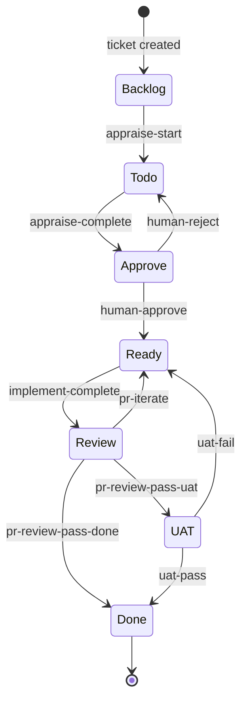

# ticket-auto-pipeline

Fully autonomous Linear ticket pipeline as a Claude Code plugin. Appraise, implement, verify, and merge — zero user input required.

## Install

```bash
# Add the marketplace first (one-time)
claude plugin marketplace add willard-pro/claude-plugins

# Install the plugin
claude plugin install ticket-auto-pipeline@willard-pro-claude-plugins
```

Verify everything is wired up — from within Claude Code:

```
/ticket-env-check
```

This validates all required env vars (`LINEAR_API_KEY`, `GITHUB_PERSONAL_ACCESS_TOKEN`/`GH_TOKEN`, `ANTHROPIC_AUTH_TOKEN`) and CLAUDE.md fields. Fix any failures before running pipeline commands.

## Required Environment

| Variable | Purpose |
|----------|---------|
| `LINEAR_API_KEY` | Linear API authentication |
| `GITHUB_PERSONAL_ACCESS_TOKEN` (or `GH_TOKEN`) | GitHub CLI + PR operations |
| `ANTHROPIC_AUTH_TOKEN` | Claude API key |

Optional:

| Variable | Purpose |
|----------|---------|
| `ANTHROPIC_BASE_URL` | Custom API endpoint |
| `ANTHROPIC_MODEL` / `ANTHROPIC_DEFAULT_OPUS_MODEL` etc. | Model overrides |
| `GIT_AUTHOR_NAME` / `GIT_AUTHOR_EMAIL` | Commit authorship |
| `UAT_URL` | UAT environment URL for verification |
| `REPOS_ROOT` | Workspace root (default: `~/repos`) |
| `TICKET_AUTONOMY` | Default autonomy mode — `manual` (default), `auto`, or `semi-auto` |

## Required MCP Servers

The pipeline requires these MCP servers configured in `.claude.json`:

- **linear-server** — Linear ticket operations
- **playwright** — Browser automation for UAT
- **github** — PR management and code review

## Slash Commands

### Core Pipeline

| Command | What it does |
|---------|-------------|
| `/ticket-auto <id>` | Full autonomous pipeline |
| `/ticket-appraise <id>` | Investigation + complexity analysis |
| `/ticket-appraise-exec <id>` | Artifact creation (simple-fix.md or openspec change) |
| `/ticket-implement <id>` | Implementation workflow |
| `/ticket-verify <id>` | Post-implementation Playwright UAT |
| `/ticket-pr-review <id>` | PR code review pass |
| `/ticket-pr-iterate <id>` | Iteration on PR feedback |

### Flow Control

| Command | What it does |
|---------|-------------|
| `/ticket-flow <id> <trigger>` | State/label mutation executor (wraps `flow.sh`) |
| `/ticket-setup <id>` | Ticket workspace scaffolding |
| `/ticket-retro [id]` | Pipeline failure analysis |
| `/ticket-overseer` | Pipeline queue dashboard report |

### Supporting

`ticket-batch-appraise`, `ticket-batch-verify`, `ticket-critique`, `ticket-detect-resume`, `ticket-reproduce`, `wiki-maintenance`, `nav-hints`, `app-knowledge`.

## Architecture

### Layering

All tickets flow through a state machine with eight states. Skills never mutate Linear state or labels directly — every transition is a trigger executed by `/ticket-flow` which wraps `flow.sh`, a deterministic bash script.



The two rework loops are `pr-iterate` (code review found gaps) and `uat-fail` (acceptance testing failed). Both send the ticket back to Ready for another implementation pass. **Blocked** is orthogonal — tickets enter it when waiting on external dependencies.

### Determinism Boundary

```
AI (skills/*.md)           Deterministic (flow.sh + lib/*.sh)
├─ /ticket-appraise         ├─ linear-api.sh (GraphQL client)
├─ /ticket-appraise-exec    ├─ flow.sh (state machine executor)
├─ /ticket-implement        ├─ validate-linear-config.sh
├─ /ticket-verify           ├─ ticket-dir.sh
├─ /ticket-pr-review        ├─ validate-env.sh
└─ /ticket-auto (orchestrator) └─ notes-parse.sh
```

Skills plan, reason, and navigate code. `flow.sh` executes mutations with idempotency checks and post-trigger state assertions — if the live Linear state doesn't match expectations after a mutation, it exits 7.

### Shared Libraries (`lib/`)

| File | Purpose |
|------|---------|
| `linear-api.sh` | GraphQL API with retry logic (3 attempts, backoff). `get_issue`, `get_comments`, `get_team`, `update_issue`, `get_me`, `get_project_config`. Also resolves `UAT_URL` from env → REPOS_ROOT CLAUDE.md files → git root → ancestor walk. |
| `ticket-dir.sh` | `resolve_ticket_dir <ID>` finds workspace directories matching `{ID}--slug` pattern. |
| `validate-env.sh` | Validates env vars and CLAUDE.md fields required for the pipeline. |
| `notes-parse.sh` | Extracts complexity score from `notes.md`. |

### Pipeline Log Format

Pipe-delimited: `ISO|PHASE|STEP|STATUS|MSG`. Used by the orchestrator and all sub-agents for progress tracking and crash recovery.

| Status | Meaning |
|--------|---------|
| `start` | Step began |
| `done` | Step completed successfully |
| `fail` | Step failed |
| `skip` | Step skipped |
| `waiting` | Agent spawned, waiting for result |

Phases: `APPRAISE` → `EXEC` → `GATE` → `IMPLEMENT` → `VERIFY` → `PR-REVIEW` → `MAINTENANCE`. `META` is a pseudo-phase for schema version, gate results, outcomes, and artifact paths.

### Crash Recovery

`/ticket-detect-resume` reads the pipeline log to find the last completed step. The orchestrator resumes from that point — the log is the checkpoint. Schema versioning (currently v1) protects against log format drift.

## Ticket Auto — Autonomy Modes

`/ticket-auto` accepts an autonomy flag controlling how much human intervention is needed. Resolved in order: CLI arg → `$TICKET_AUTONOMY` env var → `manual` default.

| Flag | Simple ticket at gate | Complex ticket at gate | PR merge |
|------|-----------------------|------------------------|----------|
| `--manual` / no flag | ⛔ HELD | ⛔ HELD | Human approves PR |
| `--auto` | ✅ Auto-approved | ⛔ HELD | Human approves PR |
| `--semi-auto` | ✅ Auto-approved | ⛔ HELD | Auto-merged if outcome = Smooth |

Semi-auto auto-merge only fires when all three hold: `--semi-auto` flag, complexity was `simple`, and implement outcome was `Smooth`.

## Pipeline Safety Gates

During execution, `ticket-auto` checks structural invariants and halts if violated:

| Gate | Step | Code |
|------|------|------|
| Artifact existence | 2.5 | `EXEC_NO_ARTIFACT` |
| Complexity-artifact coherence | 2 | `COMPLEXITY_ARTIFACT_MISMATCH` |
| Re-approval integrity | 5d | `APPROVAL_REVOKED` |
| Remediation brief integrity | 2.5 | `REMEDIATION_BRIEF_TRUNCATED` |
| PR verdict integrity | 5a | `PR_REVIEW_VERDICT_UNPARSEABLE` |

Each gate-stop emits a `|META|gate-stop|fail|<CODE>` line into the pipeline log. The retro skill reads these to classify failures and propose skill-file fixes.

## State

Pipeline state is stored at:

```
~/.claude/state/ticket-flow/    # Validation sentinels
~/.claude/state/ticket-retro/   # Retro proposals
```

Ticket workspaces are created in the current working directory (expected: a `tickets/` directory under the project workspace).

## Migration from Host Skills

If you have existing `~/.claude/skills/ticket-*` directories from a pre-plugin setup, run:

```bash
bash ~/.claude/plugins/cache/willard-pro-claude-plugins/ticket-auto-pipeline/*/install.sh
```

This detects old host-side skill directories and prompts to archive them. Non-destructive — moves to a timestamped archive, never deletes.
