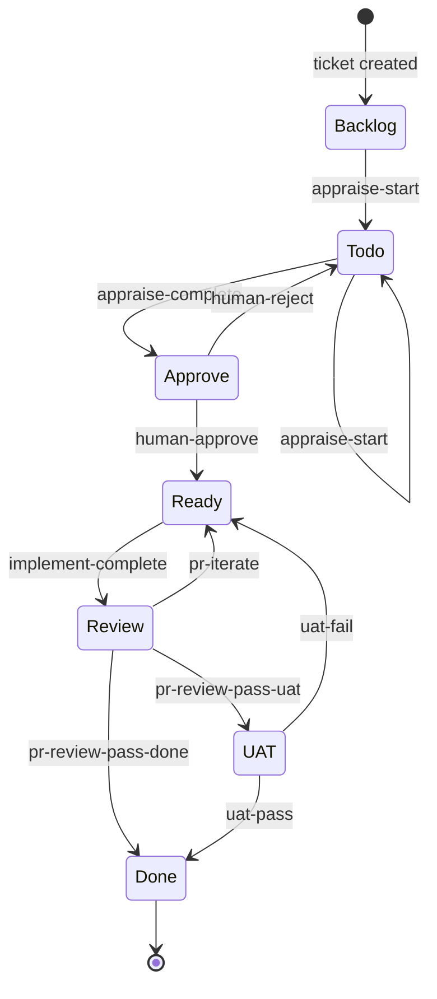

# ticket-auto-pipeline

Fully autonomous Linear ticket pipeline as a Claude Code plugin. Appraise, implement, verify, and merge — zero user input required.

## Install

```bash
# Add the marketplace first (one-time)
claude plugin marketplace add willard-pro/claude-plugins

# Install the plugin
claude plugin install ticket-auto-pipeline@willard-pro-claude-plugins
```

Verify everything is wired up — from within Claude Code:

```
/ticket-env-check
```

This validates all required env vars (`LINEAR_API_KEY`, `GITHUB_PERSONAL_ACCESS_TOKEN`/`GH_TOKEN`, `ANTHROPIC_AUTH_TOKEN`) and CLAUDE.md fields. Fix any failures before running pipeline commands.

## Quickstart

After install, get through these steps before running your first pipeline:

**1. Set environment variables** in `~/.claude/settings.local.json`:

```json
{
  "env": {
    "LINEAR_API_KEY": "lin_api_...",
    "GITHUB_PERSONAL_ACCESS_TOKEN": "ghp_...",
    "ANTHROPIC_AUTH_TOKEN": "sk-ant-..."
  }
}
```

**2. Configure MCP servers** in `~/.claude.json` (see [MCP Config](#required-mcp-servers) below for full examples).

**3. Set project fields** in your working directory's `CLAUDE.md`:

```markdown
# CLAUDE.md
REPOS_ROOT: /home/you/repos
LOCAL_URL: http://localhost:5173
UAT_URL: https://staging.example.com
```

**4. Validate the full setup** from within Claude Code:

```
/ticket-env-check
```

Then confirm your Linear team's states and labels match the state machine:

```bash
bash ticket-auto-pipeline/validate-linear-config.sh
```

**5. Run your first pipeline:**

```
/ticket-auto <ticket-id>
```

Use `--auto` or `--semi-auto` for reduced gating (see [Autonomy Modes](#ticket-auto--autonomy-modes)).

## Ticket Templates

The pipeline extracts structured data from Linear ticket descriptions at multiple phases. Poorly written tickets cause the pipeline to guess — increasing appraise time, triggering false verification passes, and burning extra LLM cycles recovering information that should have been in the ticket.

The [`templates/`](templates/) directory provides four ready-to-copy templates for creating tickets that give the pipeline exactly what it needs:

| Template | Label | Use when |
|----------|-------|----------|
| [`bug.md`](templates/bug.md) | `bug` | Something that worked before is now broken |
| [`feature.md`](templates/feature.md) | `feature` | Net-new capability that doesn't exist yet |
| [`improvement.md`](templates/improvement.md) | `improvement` | Improving or extending an existing feature |
| [`security.md`](templates/security.md) | `security` | Vulnerability, auth bypass, or data exposure |

**Why it matters for the pipeline:**

| Template field | Pipeline phase that reads it | Without it |
|----------------|------------------------------|------------|
| Atomic acceptance criteria | `ticket-verify` — one criterion = one browser assertion | Pipeline expands vague phrases at verify time; risks false passes |
| Test User | `ticket-verify` pre-flight (Step 1.7a) | Falls back through 4 sources; may pick the wrong user |
| Navigation Path (click-by-click) | `ticket-verify` — drives Playwright navigation | Direct URL navigation breaks Angular session state |
| Scope table | `ticket-appraise` — fires multi-service / cross-layer complexity axes | Complexity may be underscored; simple-fix artifact generated for a complex ticket |
| Test Data Prerequisites | `ticket-verify` pre-flight gate | Verify runs against missing data and fails with misleading errors |

Copy the relevant template into the Linear ticket description before running `/ticket-auto`. The pipeline will parse the structure without needing to infer it.

## Required Environment

| Variable | Purpose |
|----------|---------|
| `LINEAR_API_KEY` | Linear API authentication |
| `GITHUB_PERSONAL_ACCESS_TOKEN` (or `GH_TOKEN`) | GitHub CLI + PR operations |
| `ANTHROPIC_AUTH_TOKEN` | Claude API key |

Optional:

| Variable | Purpose |
|----------|---------|
| `ANTHROPIC_BASE_URL` | Custom API endpoint |
| `ANTHROPIC_MODEL` / `ANTHROPIC_DEFAULT_OPUS_MODEL` etc. | Model overrides |
| `GIT_AUTHOR_NAME` / `GIT_AUTHOR_EMAIL` | Commit authorship |
| `UAT_URL` | UAT environment URL for verification |
| `REPOS_ROOT` | Workspace root (default: `~/repos`) |
| `TICKET_AUTONOMY` | Default autonomy mode — `manual` (default), `auto`, or `semi-auto` |

Fleet controller configuration (all optional, safe defaults):

| Variable | Default | Description |
|----------|---------|-------------|
| `FLEET_POLL_INTERVAL` | 30 | Seconds between monitor mode cycles |
| `FLEET_STALL_WARN_SECS` | 300 | Stale heartbeat threshold for WARN |
| `FLEET_STALL_KILL_SECS` | 900 | Stale heartbeat threshold for KILL |
| `FLEET_STALL_RESTART_SECS` | 1800 | Stale heartbeat threshold for KILL+RESTART |
| `FLEET_ABANDON_WARN_HOURS` | 1 | Abandonment threshold for WARN |
| `FLEET_ABANDON_KILL_HOURS` | 4 | Abandonment threshold for KILL+RESTART |
| `FLEET_MAX_RESTARTS` | 2 | Max automatic restarts before giving up |
| `FLEET_AUTO_RESTART` | false | Must be `true` to enable automatic restarts |
| `FLEET_DRY_RUN` | false | When `true`, interventions are logged not executed |
| `FLEET_MAX_LOG_AGE_HOURS` | (unset) | Skip pipeline logs older than N hours (unset = scan all) |

## Required MCP Servers

The pipeline requires three MCP servers configured in `~/.claude.json` (or `.claude.json` in your project root):

```json
{
  "mcpServers": {
    "linear-server": {
      "command": "npx",
      "args": ["-y", "@linear/mcp-server"],
      "env": {
        "LINEAR_API_KEY": "${LINEAR_API_KEY}"
      }
    },
    "playwright": {
      "command": "npx",
      "args": ["-y", "@anthropic/mcp-server-playwright"]
    },
    "github": {
      "command": "npx",
      "args": ["-y", "@anthropic/github-mcp-server"],
      "env": {
        "GITHUB_PERSONAL_ACCESS_TOKEN": "${GITHUB_PERSONAL_ACCESS_TOKEN}"
      }
    }
  }
}
```

| Server | Purpose |
|--------|---------|
| `linear-server` | Linear ticket operations (issue reads, state/label mutations) |
| `playwright` | Browser automation for UAT verification |
| `github` | PR management, code review, and CI checks |

Restart Claude Code after adding MCP servers.

## Slash Commands

### Core Pipeline

| Command | What it does |
|---------|-------------|
| `/ticket-auto <id>` | Full autonomous pipeline |
| `/ticket-appraise <id>` | Investigation + complexity analysis |
| `/ticket-appraise-exec <id>` | Artifact creation (simple-fix.md or openspec change) |
| `/ticket-implement <id>` | Implementation workflow |
| `/ticket-verify <id>` | Post-implementation Playwright UAT |
| `/ticket-pr-review <id>` | PR code review pass |
| `/ticket-pr-iterate <id>` | Iteration on PR feedback |
| `/ticket-prescan [path]` | Build durable agent-knowledge docs for a repo |

### Flow Control

| Command | What it does |
|---------|-------------|
| `/ticket-flow <id> <trigger>` | State/label mutation executor (wraps `flow.sh`) |
| `/ticket-setup <id>` | Ticket workspace scaffolding |
| `/ticket-retro [id]` | Pipeline failure analysis |

### Monitoring & Fleet Control

| Command | What it does |
|---------|-------------|
| `/ticket-overseer` | Pipeline queue dashboard report (human-facing) |
| `/ticket-fleet-controller monitor` | Continuous detection loop with automated kill/restart |
| `/ticket-fleet-controller status` | One-shot health dashboard + markdown report |
| `/ticket-fleet-controller intervene <id>` | Manual kill or restart of a specific pipeline |

### Supporting

`ticket-audit`, `ticket-audit-exec`, `ticket-batch-appraise`, `ticket-batch-verify`, `ticket-critique`, `ticket-detect-resume`, `ticket-fleet-controller`, `ticket-reproduce`, `wiki-maintenance`, `nav-hints`, `app-knowledge`.

## Architecture

### Layering

All tickets flow through a state machine with eight states. Skills never mutate Linear state or labels directly — every transition is a trigger executed by `/ticket-flow` which wraps `flow.sh`, a deterministic bash script.



The two rework loops are `pr-iterate` (code review found gaps) and `uat-fail` (acceptance testing failed). Both send the ticket back to Ready for another implementation pass. **Blocked** is orthogonal — tickets enter it when waiting on external dependencies.

### Determinism Boundary

```
AI (named agent types)       Deterministic (flow.sh + lib/*.sh)
├─ ticket-appraise-agent      ├─ linear-api.sh (GraphQL client)
├─ ticket-implement-agent     ├─ flow.sh (state machine executor)
├─ ticket-verify-agent        ├─ gate-check.sh (bash gate logic)
├─ ticket-pr-review-agent     ├─ outcome-label-check.sh (outcome guard)
├─ ticket-maintenance-agent   ├─ detect-resume.sh (state parser)
├─ ticket-gate-reconcile-agent├─ validate-linear-config.sh
└─ ticket-auto (thin router)  └─ notes-parse.sh
```

Skills plan, reason, and navigate code. `flow.sh` executes mutations with idempotency checks and post-trigger state assertions — if the live Linear state doesn't match expectations after a mutation, it exits 7.

### Shared Libraries (`lib/`)

| File | Purpose |
|------|---------|
| `linear-api.sh` | GraphQL API with retry logic (3 attempts, backoff). `get_issue`, `get_comments`, `get_team`, `update_issue`, `get_me`, `get_project_config`. Also resolves `UAT_URL` from env → REPOS_ROOT CLAUDE.md files → git root → ancestor walk. |
| `ticket-dir.sh` | `resolve_ticket_dir <ID>` finds workspace directories matching `{ID}--slug` pattern. |
| `validate-env.sh` | Validates env vars and CLAUDE.md fields required for the pipeline. |
| `notes-parse.sh` | Extracts complexity score from `notes.md`. |
| `config.sh` | Central config with `${VAR:-default}` pattern. Pipeline thresholds, fleet controller settings (`FLEET_STALL_WARN_SECS`, `FLEET_AUTO_RESTART`, etc.), temp file conventions. |
| `spawn-helper.sh` | Agent spawn infrastructure. `spawn_write_env`, `spawn_agent_pre` (pinger/watchdog start + stop-file guard), `spawn_agent_post` (PID reaping + result logging). |
| `heartbeat.sh` | Fine-grained operational log library. 7 helpers (`hb_init`, `hb_decision`, `hb_fallback`, `hb_heartbeat`, `hb_api`, `hb_gate`, `hb_retry`, `hb_source`) validate and write 6-field entries. All helpers are no-ops when `HB_LOG_FILE` is unset. |
| `fleet-detect.sh` | 6 detection engines (phase failures, stalls, zombies, loops, abandonment, flow failures). Aggregator `fleet_detect_all` outputs JSON. |
| `fleet-intervene.sh` | Intervention executor: `fleet_kill_pipeline`, `fleet_restart_pipeline`, `fleet_can_restart`. flow.sh mutex-aware, `FLEET_DRY_RUN` guard. |
| `fleet-dashboard.sh` | Dashboard renderer: `fleet_render_dashboard` (terminal) and `fleet_write_report` (markdown). |
| `gate-check.sh` | Deterministic bash gate logic. `--mode entry` checks artifact, complexity, autonomy. `--mode reapprove` checks live Linear state. Replaces inline LLM reasoning. |
| `outcome-label-check.sh` | Bash-only post-implement guard for Smooth/Rough/Hard outcome label. |
| `detect-resume.sh` | Pipeline log state parser. Called directly as bash by the thin router — outputs 21 routing variables including counters (VERIFY_ATTEMPTS, VERIFY_LAST, ITERATION, RECONCILE_CYCLE, PR_FEEDBACK_CYCLE). |

### Pipeline Log Format

Pipe-delimited: `ISO|PHASE|STEP|STATUS|MSG`. Used by the orchestrator and all sub-agents for progress tracking and crash recovery.

| Status | Meaning |
|--------|---------|
| `start` | Step began |
| `done` | Step completed successfully |
| `fail` | Step failed |
| `skip` | Step skipped |
| `waiting` | Agent spawned, waiting for result |

Phases: `APPRAISE` → `EXEC` → `GATE` → `IMPLEMENT` → `VERIFY` → `PR-REVIEW` → `MAINTENANCE`. `META` is a pseudo-phase for schema version, gate results, outcomes, and artifact paths.

### Heartbeat Log Format

Pipe-delimited: `ISO|CATEGORY|EVENT|STATUS|MSG|DETAIL`. Records decisions, fallbacks, retries, liveness signals, API timing, gate evaluations, and configuration provenance. Complements the pipeline log — pipeline tracks _what_, heartbeat tracks _why_.

| Category | Meaning | Typical status |
|----------|---------|----------------|
| `decision` | Complexity scoring, merge verdicts, autonomy resolution | `fired` |
| `fallback` | Primary path unavailable, fallback activated | `fired` |
| `heartbeat` | Periodic liveness signal during long operations | `ok` |
| `api` | External API call (Linear, GitHub, Playwright) | `ok`, `fail` |
| `gate` | Gate evaluation, trigger dispatch, idempotency checks | `ok`, `fail` |
| `retry` | Error classification and retry decision | `info`, `fired` |
| `source` | Configuration value provenance (UAT_URL resolution, etc.) | `info` |

`DETAIL` is a flat JSON object with string values (`{"key":"value"}`) or `{}`. Schema version **1** — declared as first line: `ISO|META|schema|info|1|{}`. All writes via `lib/heartbeat.sh` helpers; agents supply values, the library enforces format. Consumers: `dashboard.py` (dual-panel view), `report.py` (stall detection), `retro.sh` (trend aggregation), `fleet-detect.sh` (flow failure detection, loop detection).

### Crash Recovery

The thin router calls `detect-resume.sh` directly as bash (no Claude agent spawn) to read the pipeline log and find the last completed step. The router resumes from that point — the log is the checkpoint. After every phase dispatch, the router re-reads state from the log via `detect-resume.sh`. Schema versioning (currently v1) protects against log format drift. Heartbeat log entries provide additional operational context for diagnosing failures during recovery.

## Ticket Auto — Autonomy Modes

`/ticket-auto` accepts an autonomy flag controlling how much human intervention is needed. Resolved in order: CLI arg → `$TICKET_AUTONOMY` env var → `manual` default.

| Flag | Simple ticket at gate | Complex ticket at gate | PR merge |
|------|-----------------------|------------------------|----------|
| `--manual` / no flag | ⛔ HELD | ⛔ HELD | Human approves PR |
| `--auto` | ✅ Auto-approved | ⛔ HELD | Auto-merged if outcome = Smooth |
| `--semi-auto` | ✅ Auto-approved | ⛔ HELD | Auto-merged if outcome = Smooth |

Auto-merge fires in both `--auto` and `--semi-auto` modes (never in `--manual`) when all three hold: autonomy is `auto` or `semi-auto`, complexity was `simple`, and the confirmed Linear outcome label was `Smooth`. The outcome is read from the `META|outcome-label|info|` pipeline-log line written by `outcome-label-check.sh` — the authoritative, Linear-confirmed label — not from the implement phase's own terminal line.

## Pipeline Safety Gates

During execution, the thin router runs deterministic bash gate checks (`gate-check.sh`, `outcome-label-check.sh`) — zero Claude agent involvement. Gate violations halt the pipeline:

| Gate | Checked by | Code |
|------|-----------|------|
| Artifact existence | `gate-check.sh --mode entry` | `EXEC_NO_ARTIFACT` |
| Complexity-artifact coherence | `gate-check.sh --mode entry` | `COMPLEXITY_ARTIFACT_MISMATCH` |
| Autonomy-based routing | `gate-check.sh --mode entry` | (held or auto-approved) |
| Adversarial review blocked | `ticket-appraise-exec` agent | `ADVERSARIAL_BLOCKED` |
| Re-approval integrity | `gate-check.sh --mode reapprove` | `APPROVAL_REVOKED` |
| Remediation brief integrity | `gate-check.sh --mode entry` | `REMEDIATION_BRIEF_TRUNCATED` |
| Outcome label present | `outcome-label-check.sh` | (applies missing label) |
| PR verdict integrity | `ticket-pr-review-agent` | `PR_REVIEW_VERDICT_UNPARSEABLE` |

Each gate-stop emits a `|META|gate-stop|fail|<CODE>` line into the pipeline log. The retro skill reads these to classify failures and propose skill-file fixes.

## Troubleshooting

### Env check failures

`/ticket-env-check` reports missing variables with a red FAIL marker. Common fixes:

- **`LINEAR_API_KEY` missing**: Add to `~/.claude/settings.local.json` under `env`. Generate from Linear → Settings → API.
- **`GITHUB_PERSONAL_ACCESS_TOKEN` missing**: Add to same `env` block. Generate from GitHub → Settings → Developer settings → Personal access tokens. Needs `repo` and `pull_requests` scopes.
- **CLAUDE.md fields missing**: Add `REPOS_ROOT`, `LOCAL_URL`, `UAT_URL` to your project's `CLAUDE.md`. These are project-specific, not global.

### State machine drift

If `validate-linear-config.sh` reports states or labels missing from your Linear team:

1. Check which workflow states/labels are missing in the script output
2. Add missing items in Linear → Team Settings → Workflow
3. Re-run the validator

Use `--dry-run` to preview without failing:

```bash
bash ticket-auto-pipeline/validate-linear-config.sh --dry-run
```

### MCP auth errors

- **"Linear API key not configured"**: The `linear-server` MCP config uses `${LINEAR_API_KEY}` — this must be set in the same `~/.claude.json` file under `env` for each server, OR be available in the shell environment. Restart Claude Code after changes.
- **"GitHub token not configured"**: Same pattern — `github` MCP server needs `GITHUB_PERSONAL_ACCESS_TOKEN` in its env block.
- **Playwright fails to launch**: Ensure `npx` is available. Install with `npm install -g npx` if missing.

### Gate-stop codes

When the pipeline halts with a gate-stop, check the pipeline log for the specific code:

| Code | What went wrong | Fix |
|------|----------------|-----|
| `EXEC_NO_ARTIFACT` | Appraise-exec produced no artifact file | Re-run `/ticket-appraise-exec <id>`. Check `notes.md` has a `## Complexity` section. |
| `COMPLEXITY_ARTIFACT_MISMATCH` | Artifact type doesn't match complexity score | Re-run `/ticket-appraise <id>` to re-evaluate complexity. |
| `ADVERSARIAL_BLOCKED` | Adversarial review found blocking issues in the plan | Review `## Adversarial Review` in notes.md, fix the plan, re-run `/ticket-appraise-exec <id> --from-step create-artifact`. |
| `APPROVAL_REVOKED` | Approved label was removed after PR changes | Re-approve the ticket in Linear (add `approved` label). |
| `REMEDIATION_BRIEF_TRUNCATED` | Remediation brief is incomplete or empty | Re-run `/ticket-appraise-exec <id>` with full remediation notes. |
| `PR_REVIEW_VERDICT_UNPARSEABLE` | PR review comment format couldn't be parsed | Check the PR review comment follows the expected verdict format. Re-run `/ticket-pr-review <id>`. |

For detailed failure analysis, run `/ticket-retro <id>` — it reads the pipeline log and heartbeat log to classify the failure and suggest fixes.

### Crash recovery

If a pipeline run is interrupted (session close, crash, timeout):

1. Run `/ticket-detect-resume <id>` — it reads the pipeline log to find the last completed step
2. Run `/ticket-auto <id>` again — it will detect the in-progress log and offer to resume
3. If the log is corrupted, delete `tickets/{ID}--*/pipeline.log` and start fresh

## Upgrading

To upgrade to a newer version of the plugin:

```bash
# Remove the cached plugin
rm -rf ~/.claude/plugins/cache/willard-pro-claude-plugins/ticket-auto-pipeline

# Re-install (pulls latest from marketplace)
claude plugin install ticket-auto-pipeline@willard-pro-claude-plugins
```

The SessionStart hook re-syncs `lib/*.sh` on next launch. Your Linear config, env vars, and state files are untouched.

Check the [CHANGELOG](../CHANGELOG.md) for what changed between versions.

## State

Pipeline state is stored at:

```
~/.claude/state/ticket-flow/    # Validation sentinels
~/.claude/state/ticket-retro/   # Retro proposals
```

Ticket workspaces are created in the current working directory (expected: a `tickets/` directory under the project workspace).

## Migration from Host Skills

If you have existing `~/.claude/skills/ticket-*` directories from a pre-plugin setup, run:

```bash
bash $(find ~/.claude/plugins/cache/willard-pro-claude-plugins/ticket-auto-pipeline -name install.sh -type f | sort -V | tail -1)
```

This detects old host-side skill directories and prompts to archive them. Non-destructive — moves to a timestamped archive, never deletes.
