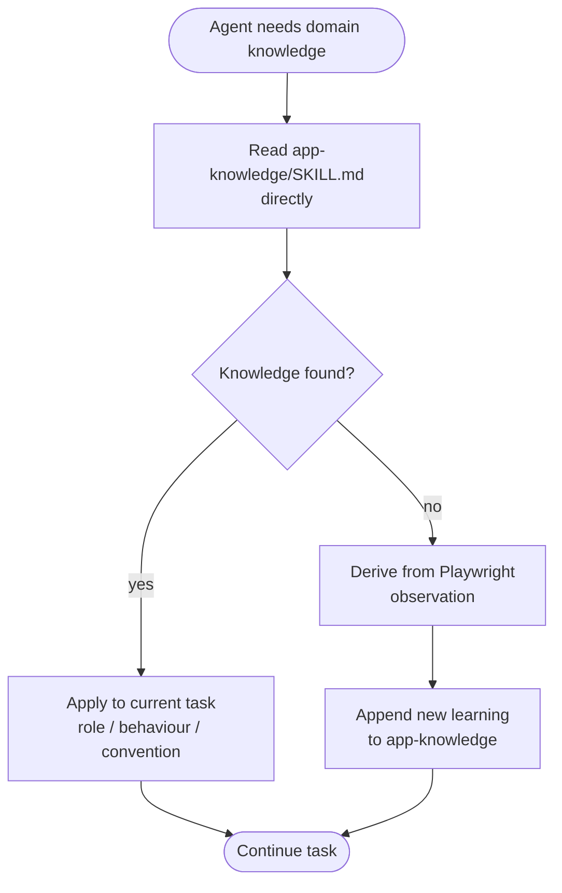

# app-knowledge

> Reference knowledge base for app business rules, user roles, UI behaviour, and system conventions. A lookup reference — not an interactive skill.

## What it does

`app-knowledge` is a living reference file, not an interactive skill — you read it directly rather than invoking it. It captures business rules, user role definitions, UI behaviour patterns, and system conventions discovered during Playwright sessions and ticket work. When reasoning about role-based behaviour during verification or reproduction, agents read this file to avoid re-deriving the same domain knowledge. New learnings are appended over time as they are discovered.

## Trigger

**Not invoked as a slash command.** Read directly:

```bash
cat ~/.claude/skills/app-knowledge/SKILL.md
```

Referenced by: `/ticket-verify`, `/ticket-reproduce`, and any agent reasoning about app behaviour.

## Inputs

| Input | Source | Required |
|-------|--------|----------|
| N/A | This skill is read-only reference material | — |

## Outputs / Artifacts

| Artifact | Location | Description |
|----------|----------|-------------|
| N/A | — | No active output; content is the artifact |

## How it works



## Related skills

- [`/nav-hints`](nav-hints.md) — click-by-click navigation companion
- [`/ticket-verify`](ticket-verify.md) — primary consumer during UAT sessions
- [`/ticket-reproduce`](ticket-reproduce.md) — reads app-knowledge during bug reproduction
