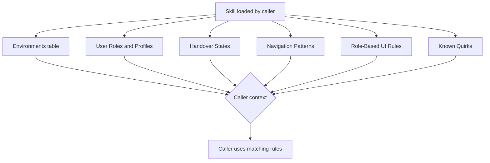

# app-knowledge

> Reference knowledge base for Credit Network app business rules, user roles, UI behaviour, and system conventions. Use this as a lookup when browsing the site via Playwright or when reasoning about role-based behaviour. Not an interactive skill -- read this file directly when you need context about how the app works. Companion: /nav-hints for click-by-click navigation paths.

## What it does

Provides a living reference of business rules, user role profiles, handover state mappings, navigation patterns, and role-based UI rules for the Credit Network application. Used by ticket-verify and ticket-reproduce as a lookup to interpret Playwright snapshots correctly and to derive navigation without guessing. Documents confirmed behaviours with source ticket references, known quirks (like the intermittent nav bar bug), and environment URLs.

## Trigger

**Slash command:** None -- read the SKILL.md file directly as a reference lookup.

**Natural language:** (loaded automatically by ticket-verify and ticket-reproduce)

## Inputs

| Input | Source | Required |
|-------|--------|----------|
| (none) | Read-only reference file | N/A |

## Outputs / Artifacts

| Artifact | Location | Description |
|----------|----------|-------------|
| (none) | Read-only | Knowledge is consumed in-memory by calling skills |

## How it works

## Related skills

- [`/nav-hints`](nav-hints.md) -- click-by-click navigation paths (companion reference)
- [`/ticket-verify`](ticket-verify.md) -- uses app-knowledge to interpret snapshots and navigate
- [`/ticket-reproduce`](ticket-reproduce.md) -- uses app-knowledge to derive reproduction steps
