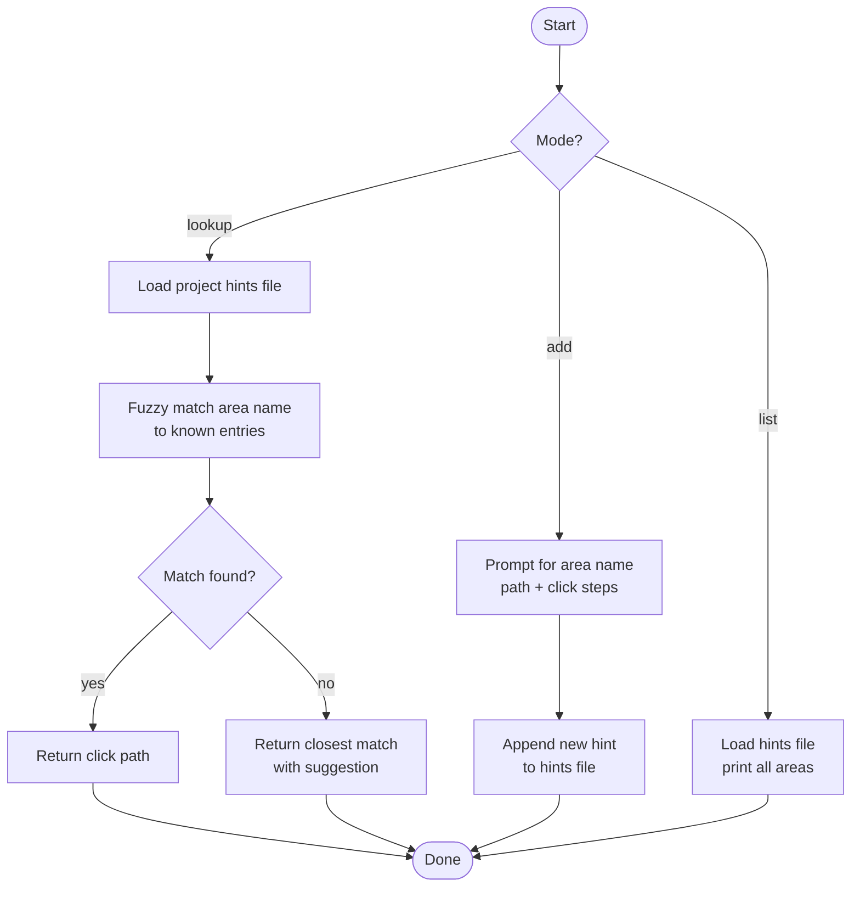

# nav-hints

> Navigation hint lookup for browser-based ticket work. Returns exact click-by-click paths to reach feature areas without direct URL navigation (which breaks Angular session state).

## What it does

`nav-hints` is a lookup utility for Playwright sessions. Angular SPAs lose session state on full-page reloads triggered by `page.goto()`, so `/ticket-verify` and `/ticket-reproduce` must always navigate by clicking through the UI. `nav-hints` stores known click-by-click paths for each feature area and returns the correct path on demand. It also supports adding new hints and listing all known areas for the current project.

## Trigger

**Slash command:**
- `/nav-hints <area>` — return click path for a feature area
- `/nav-hints add` — record a new navigation hint
- `/nav-hints list` — list all known areas

**Natural language:** "how do I get to payments in the app", "nav-hints progress"

## Inputs

| Input | Source | Required |
|-------|--------|----------|
| Area name | CLI argument | Yes (fuzzy matched) |
| Project hints file | `REPOS_ROOT/<project>/nav-hints.md` | Yes |

## Outputs / Artifacts

| Artifact | Location | Description |
|----------|----------|-------------|
| Click path | Stdout | Ordered list of UI clicks to reach the area |
| Updated hints file | Project hints file | New entry appended (add mode only) |

## How it works

## Related skills

- [`/ticket-verify`](ticket-verify.md) — uses nav-hints for Playwright navigation
- [`/ticket-reproduce`](ticket-reproduce.md) — uses nav-hints during bug reproduction
- [`/app-knowledge`](app-knowledge.md) — business rules companion to nav-hints
