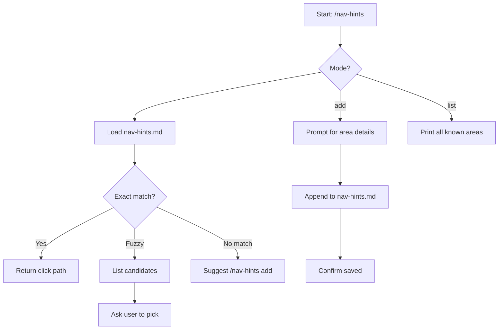

# nav-hints

> Navigation hint lookup for browser-based ticket work. Returns exact click-by-click paths to reach feature areas without direct URL navigation (which breaks Angular session state). Use when ticket-verify or ticket-reproduce needs to navigate the app, or when the user asks "how do I get to X in the app".

## What it does

Manages a project-scoped knowledge base of click-by-click UI navigation paths. Supports three modes: lookup (fuzzy matches an area name and returns the exact click path), add (records a new navigation path after successful discovery), and list (prints all known areas). Every hint records its source ticket and date for staleness detection. The central rule is no direct URLs for in-app navigation -- Angular loses session state on full page reload, so every path is click-by-click through the UI.

## Trigger

**Slash command:** `/nav-hints <area|add|list>`

**Natural language:** how do I get to X in the app

## Inputs

| Input | Source | Required |
|-------|--------|----------|
| Area name | CLI argument (for lookup) | Yes (for lookup mode) |
| nav-hints.md | {TICKETS_ROOT}/nav-hints.md | Yes |

## Outputs / Artifacts

| Artifact | Location | Description |
|----------|----------|-------------|
| Navigation path | stdout | Click-by-click instructions for the matched area |
| New hint entry | {TICKETS_ROOT}/nav-hints.md | Appended hint with path, steps, source, date |
| Area listing | stdout | All known areas with one-line summaries |

## How it works

## Related skills

- [`/app-knowledge`](app-knowledge.md) -- business rules reference (companion lookup)
- [`/ticket-verify`](ticket-verify.md) -- primary consumer; saves new hints after successful navigation
- [`/ticket-reproduce`](ticket-reproduce.md) -- secondary consumer; uses hints for bug reproduction
