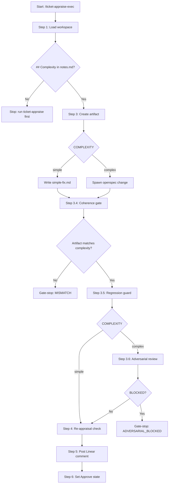

# ticket-appraise-exec

> Artifact executor for a Linear ticket that has already been investigated by /ticket-appraise. Reads the complexity score from notes.md, creates either simple-fix.md or an openspec change, assigns the ticket in Linear, posts the appraisal comment, and moves to Approve state. Run after /ticket-appraise has fully populated notes.md.

## What it does

Consumes the investigation findings from notes.md and produces the implementation artifact. For simple tickets it writes a concrete simple-fix.md with affected files and step-by-step instructions. For complex tickets it spawns an openspec change via `/opsx:propose`. Runs a regression guard to cross-reference the plan against prior art, and for complex tickets spawns an adversarial review agent to find gaps before implementation begins. Posts a summary comment to Linear and moves the ticket to the Approve state.

## Trigger

**Slash command:** `/ticket-appraise-exec <ID>`

**Natural language:** (called after /ticket-appraise completes)

## Inputs

| Input | Source | Required |
|-------|--------|----------|
| Ticket ID | CLI argument | Yes |
| notes.md | {ticket-dir}/notes.md | Yes (must contain ## Complexity with Score) |
| context.md | {ticket-dir}/context.md | Yes |
| LINEAR_API_KEY | Environment variable | Yes |
| REPOS_ROOT | CLAUDE.md | Yes |
| BE_SERVICES | CLAUDE.md | No |
| --from-auto flag | CLI (set by ticket-auto) | No |
| --from-step flag | CLI (crash recovery) | No |

## Outputs / Artifacts

| Artifact | Location | Description |
|----------|----------|-------------|
| simple-fix.md | {ticket-dir}/simple-fix.md | Implementation plan for simple tickets |
| openspec change | openspec/changes/{name}/ | Design, tasks, and specs for complex tickets |
| Adversarial review | notes.md (## Adversarial Review) | Gap analysis from adversarial agent (complex only) |
| Regression risk table | notes.md (## Regression Risk) | Conflict detection against prior art |
| Linear comment | Linear ticket | Appraisal summary posted to ticket |
| Linear state | Linear | Ticket moved to Approve + claimed |

## How it works

## Related skills

- [`/ticket-appraise`](ticket-appraise.md) — investigation phase (must run first)
- [`/ticket-flow`](ticket-flow.md) — state transitions (called at Step 6)
- [`/ticket-implement`](ticket-implement.md) — consumes the artifact produced here
