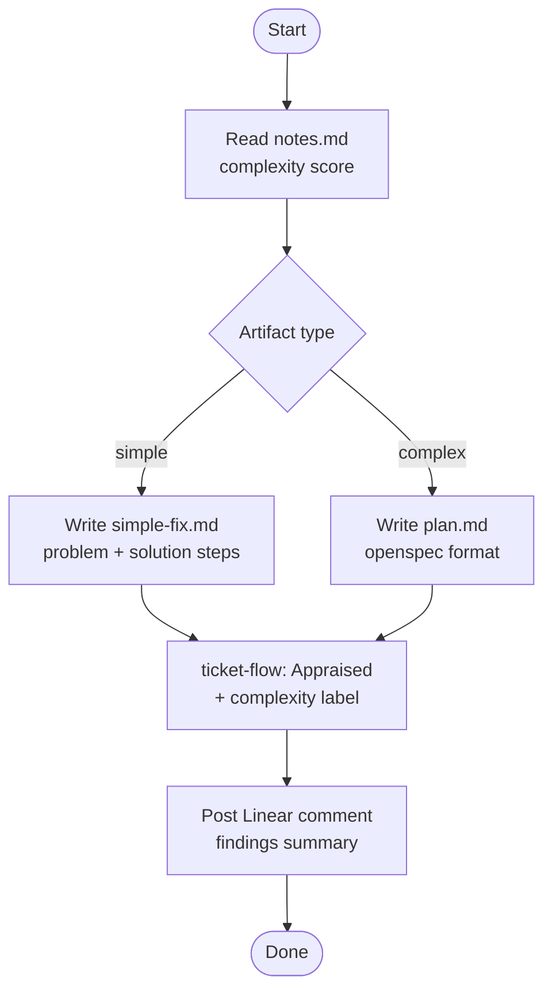

# ticket-appraise-exec

> Artifact creator and Linear updater for an appraised ticket. Reads notes.md, creates the plan artifact, updates Linear state and complexity label, and posts a summary comment.

## What it does

`ticket-appraise-exec` is the second half of the appraisal phase. It picks up where `/ticket-appraise` left off: reads the completed `notes.md`, determines the artifact type (simple-fix or openspec plan), writes the plan file to the ticket workspace, transitions Linear to the `Appraised` state, applies the correct complexity label, and posts a summary comment to the issue. This skill is the bridge between investigation and approval/implementation.

## Trigger

**Slash command:** `/ticket-appraise-exec <TICKET-ID>`

**Natural language:** "exec appraise for WIL-42", "create artifacts for WIL-42" (typically called by `/ticket-auto` or right after `/ticket-appraise`)

## Inputs

| Input | Source | Required |
|-------|--------|----------|
| Ticket ID | CLI argument | Yes |
| `notes.md` | Ticket workspace (written by ticket-appraise) | Yes |
| `LINEAR_API_KEY` | Environment variable | Yes |
| `ISSUE_PREFIX` | CLAUDE.md field | Yes |

## Outputs / Artifacts

| Artifact | Location | Description |
|----------|----------|-------------|
| Plan artifact | `tickets/<ID>--slug/simple-fix.md` or `plan.md` | Implementation blueprint (simple-fix or openspec format) |
| Linear state | Linear issue | Transitioned to `Appraised` |
| Complexity label | Linear issue | `complexity:simple` or `complexity:complex` applied |
| Linear comment | Linear issue | Summary of findings and next steps |

## How it works

## Related skills

- [`/ticket-appraise`](ticket-appraise.md) — must run first to populate notes.md
- [`/ticket-flow`](ticket-flow.md) — handles all Linear state and label mutations
- [`/ticket-implement`](ticket-implement.md) — next step after approval
- [`/ticket-auto`](ticket-auto.md) — orchestrator that drives this skill automatically
