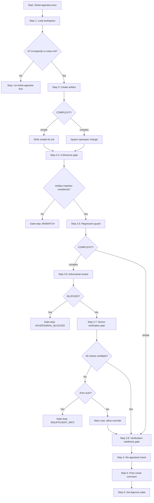

# ticket-appraise-exec

> Artifact executor for a Linear ticket that has already been investigated by /ticket-appraise. Reads the complexity score from notes.md, creates either simple-fix.md or an openspec change, derives a verification plan (complex tickets), gates on verification readiness, assigns the ticket in Linear, posts the appraisal comment, and moves to Approve state. Run after /ticket-appraise has fully populated notes.md.

## What it does

Consumes the investigation findings from notes.md and produces the implementation artifact. For simple tickets it writes a concrete simple-fix.md with affected files and step-by-step instructions. For complex tickets it spawns an openspec change via `/opsx:propose`. Runs a regression guard to cross-reference the plan against prior art, and for complex tickets spawns an adversarial review agent to find gaps before implementation begins.

**New in 0.12.10:** For complex tickets, Step 3.7 derives a structured verification plan — determining role scope, navigation paths, expected behaviors, and test data requirements for each acceptance criterion. If any criterion cannot be fully derived, the pipeline pushes back with gate-stop codes (`VERIFY_PLAN_NO_ROLE_SCOPE`, `VERIFY_PLAN_NO_NAV_PATH`, `VERIFY_PLAN_VAGUE_BEHAVIOR`, `VERIFY_PLAN_NO_TEST_DATA`) before implementation starts. Role scope findings are ingested into `app-knowledge/SKILL.md` under a `## Role Scope Registry` section for future appraisals. The verification-readiness gate (Step 3.8) reads the derived plan from notes.md when present, falling back to plan artifact scan for backward compat.

Posts a summary comment to Linear and moves the ticket to the Approve state.

## Trigger

**Slash command:** `/ticket-appraise-exec <ID>`

**Natural language:** (called after /ticket-appraise completes)

## Inputs

| Input | Source | Required |
|-------|--------|----------|
| Ticket ID | CLI argument | Yes |
| notes.md | {ticket-dir}/notes.md | Yes (must contain ## Complexity with Score) |
| context.md | {ticket-dir}/context.md | Yes |
| LINEAR_API_KEY | Environment variable | Yes |
| REPOS_ROOT | CLAUDE.md | Yes |
| BE_SERVICES | CLAUDE.md | No |
| --from-auto flag | CLI (set by ticket-auto) | No |
| --from-step flag | CLI (crash recovery) | No |
| app-knowledge/SKILL.md | Plugin skill file | Step 3.7 only |
| test-users.json | Project-local (not bundled; copy from config/test-users.example.json) | Step 3.7 only |
| nav-hints/SKILL.md | Plugin skill file | Step 3.7 only |

## Outputs / Artifacts

| Artifact | Location | Description |
|----------|----------|-------------|
| simple-fix.md | {ticket-dir}/simple-fix.md | Implementation plan for simple tickets |
| openspec change | openspec/changes/{name}/ | Design, tasks, and specs for complex tickets |
| Adversarial review | notes.md (## Adversarial Review) | Gap analysis from adversarial agent (complex only) |
| Regression risk table | notes.md (## Regression Risk) | Conflict detection against prior art |
| **Verification Plan** | **notes.md (## Verification Plan)** | **Per-criterion role scope, nav path, expected behavior, test data (complex only, Step 3.7)** |
| **Role Scope Registry** | **app-knowledge/SKILL.md (## Role Scope Registry)** | **Cumulative role scope findings for future appraisals (Step 3.7)** |
| Verification Readiness | notes.md (## Verification Readiness) | Gate verdict with 4-prerequisite checklist (Step 3.8) |
| Linear comment | Linear ticket | Appraisal summary posted to ticket |
| Linear state | Linear | Ticket moved to Approve + claimed |

## Step flow

```
Step 1   — Load ticket workspace
Step 1.5 — Create task tracker + session trace
Step 2   — State check (already set by appraise)
Step 3   — Create change artifacts (simple-fix.md or openspec change)
Step 3.4 — Complexity-coherence gate
Step 3.5 — Regression guard (cross-reference against prior art)
Step 3.6 — Adversarial review (complex tickets only)
Step 3.7 — Derive verification plan (complex tickets only)     ← NEW in 0.12.10
Step 3.8 — Verification-readiness gate                         ← Renumbered
Step 4   — Check for re-appraisal skip
Step 5   — Post Linear comment
Step 6   — Set Linear state → Approve
Step 7   — Report to user
```

## How it works



## Push-back codes (Step 3.7)

These gate-stop codes halt the pipeline when a criterion cannot be fully derived. In `--from-auto` mode the pipeline stops immediately. In interactive mode the user can override and proceed with a partial plan.

| Gate-stop code | Trigger |
|----------------|---------|
| `VERIFY_PLAN_NO_ROLE_SCOPE` | Role scope cannot be determined for any criterion |
| `VERIFY_PLAN_NO_NAV_PATH` | Navigation path cannot be determined for any criterion |
| `VERIFY_PLAN_VAGUE_BEHAVIOR` | Expected behavior uses vague language with no observable outcome |
| `VERIFY_PLAN_NO_TEST_DATA` | Test data is required but no setup mechanism is documented |

## Verification Plan schema (Step 3.7 output)

Written to notes.md under `## Verification Plan`:

- **Metadata:** Date, derived-by, overall role scope
- **Role Scope Assessment table:** Feature area, affected roles, scope type (global/role-specific), confidence (high/medium/low), basis
- **Per-Criterion Verification table:** One row per acceptance criterion with role scope, navigation path, test data needed, expected behavior, and verifiable status

## Role Scope Registry (wiki ingestion)

After successful derivation, role scope findings are appended to `app-knowledge/SKILL.md` under `## Role Scope Registry`:

```
### {TICKET-ID} — {feature area}
- **Role scope:** {global | role-specific: {roles}}
- **Confidence:** {high|medium|low}
- **Source:** verification plan derivation (ticket-appraise-exec Step 3.7)
- **Date:** {today}
```

Duplicate ticket IDs (from re-appraisal) are handled by striking through the old entry. Wiki write failures are non-blocking.

## Related skills

- [`/ticket-appraise`](ticket-appraise.md) — investigation phase (must run first)
- [`/ticket-flow`](ticket-flow.md) — state transitions (called at Step 6)
- [`/ticket-implement`](ticket-implement.md) — consumes the artifact produced here
- [`/ticket-verify`](ticket-verify.md) — consumes the verification plan at test time
- [`/app-knowledge`](app-knowledge.md) — receives role scope registry entries
- [`/nav-hints`](nav-hints.md) — referenced for navigation path derivation
- [`/ticket-gate-reconcile`](ticket-gate-reconcile.md) — handles post-gate-hold re-approval
