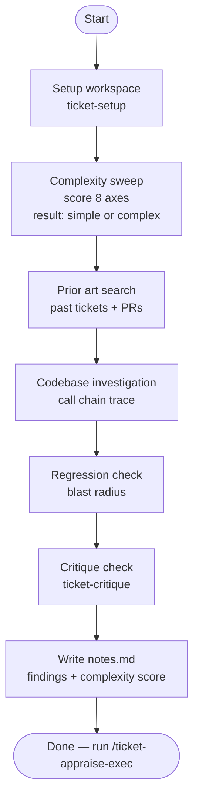

# ticket-appraise

> Investigation planner for a Linear ticket. Fetches the issue, creates the local directory structure, runs a complexity sweep, searches prior art, and traces the full codebase call chain. Writes findings to notes.md.

## What it does

`ticket-appraise` is the investigation phase of the pipeline. It fetches the Linear ticket, sets up the local workspace, scores the ticket's complexity across multiple axes (blast radius, prior art, interdependency), and traces the relevant call chains in the codebase. All findings are written to `notes.md` in the ticket's workspace directory. It does not touch Linear state — that is handled by the subsequent `/ticket-appraise-exec`.

## Trigger

**Slash command:** `/ticket-appraise <TICKET-ID>`

**Natural language:** "appraise ticket WIL-42", "take on ticket WIL-42", "investigate WIL-42"

## Inputs

| Input | Source | Required |
|-------|--------|----------|
| Ticket ID | CLI argument | Yes |
| `LINEAR_API_KEY` | Environment variable | Yes |
| `REPOS_ROOT` | CLAUDE.md field | Yes |
| `ISSUE_PREFIX` | CLAUDE.md field | Yes |
| `WIKI_ROOT` | CLAUDE.md field | No (falls back to default path) |

## Outputs / Artifacts

| Artifact | Location | Description |
|----------|----------|-------------|
| `notes.md` | `tickets/<ID>--slug/` | Full investigation findings: complexity score, prior art, codebase trace, regression verdict |
| `context.md` | `tickets/<ID>--slug/` | Raw ticket data (title, description, acceptance criteria, comments) |

## How it works

## Related skills

- [`/ticket-appraise-exec`](ticket-appraise-exec.md) — must run after this to create artifacts and update Linear
- [`/ticket-setup`](ticket-setup.md) — called internally at Step 1 to create the workspace
- [`/ticket-critique`](ticket-critique.md) — called internally at Step 2.7 to validate ticket completeness
- [`/ticket-auto`](ticket-auto.md) — orchestrator that drives this skill automatically
