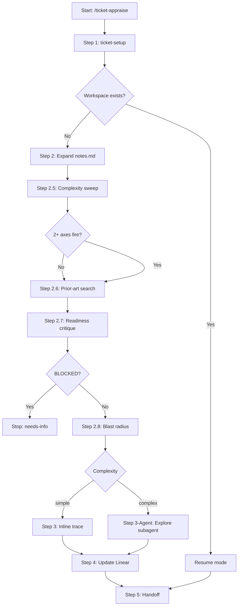

# ticket-appraise

> Investigation planner for a Linear ticket. Fetches the issue, creates the local directory structure, runs a complexity sweep, searches prior art, and traces the full codebase call chain. Writes findings to notes.md. Use when the user says "appraise ticket <ID>", "/ticket-appraise <ID>", or "take on ticket <ID>". After this completes, run /ticket-appraise-exec to create artifacts and update Linear.

## What it does

Investigates a Linear ticket end-to-end before any code is written. Sets up the local workspace via ticket-setup, scores complexity on three axes (multi-service, cross-layer, prior rejection), searches claude-mem and local tickets for prior art, runs a readiness critique, performs GitNexus blast-radius analysis, and traces the full codebase call chain. All findings are written to notes.md for the executor phase to consume.

## Trigger

**Slash command:** `/ticket-appraise <ID>`

**Natural language:** appraise ticket <ID>, take on ticket <ID>

## Inputs

| Input | Source | Required |
|-------|--------|----------|
| Ticket ID | CLI argument | Yes |
| LINEAR_API_KEY | Environment variable | Yes |
| REPOS_ROOT | CLAUDE.md | Yes |
| ISSUE_PREFIX | CLAUDE.md | Yes |
| BE_SERVICES | CLAUDE.md | No |
| WIKI_ROOT | CLAUDE.md | No |
| --from-auto flag | CLI (set by ticket-auto) | No |
| --from-step flag | CLI (crash recovery) | No |

## Outputs / Artifacts

| Artifact | Location | Description |
|----------|----------|-------------|
| notes.md | {ticket-dir}/notes.md | Complexity score, initial investigation, prior art, blast radius, open questions |
| context.md | {ticket-dir}/context.md | Ticket metadata snapshot (via ticket-setup) |
| Complexity label | Linear | simple or complex label applied |
| Pipeline log entries | $LOG_FILE | Phase progress tracked at step boundaries |

## How it works

## Related skills

- [`/ticket-appraise-exec`](ticket-appraise-exec.md) — creates artifacts from appraisal findings
- [`/ticket-setup`](ticket-setup.md) — workspace scaffolding (called internally at Step 1)
- [`/ticket-critique`](ticket-critique.md) — readiness validation (called at Step 2.7)
- [`/ticket-flow`](ticket-flow.md) — Linear state transitions (called at Step 4)
