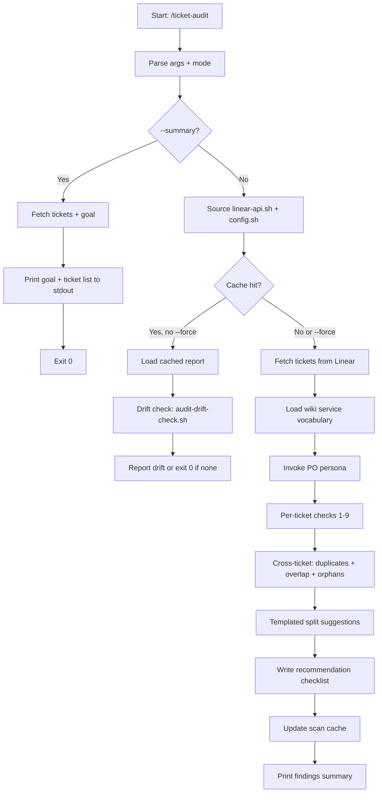

# ticket-audit

> Proactive cross-ticket audit within a milestone or parent/epic. Detects duplicates, overlaps, empty tickets, goal misalignment, stale tickets, split candidates, and wiki misalignment. Produces a recommendation checklist consumed by ticket-audit-exec. Never mutates Linear. Modes: --milestone <id>, --parent <id>. Flags: --force, --summary, --include-completed.

## What it does

Runs a comprehensive batch audit across all tickets under a Linear milestone or parent/epic. Performs nine per-ticket checks (credential gaps, untestable ACs, missing test data, scope identification, bug repro steps, empty tickets, goal misalignment, staleness, wiki misalignment) plus cross-ticket analysis (duplicate detection via Jaccard title similarity, AC overlap detection, orphan detection). Deterministic bash scripts handle clear cases; LLM reviews only borderline results. Writes a structured recommendation checklist consumed by `/ticket-audit-exec` for phased application.

## Trigger

**Slash command:** `/ticket-audit --milestone <id>` or `/ticket-audit --parent <id>`

**Natural language:** audit milestone, audit parent tickets, cross-ticket audit, find duplicate tickets

## Inputs

| Input | Source | Required |
|-------|--------|----------|
| Milestone ID or Parent ID | CLI argument (--milestone / --parent) | Yes |
| LINEAR_API_KEY | Env or settings.local.json | Yes |
| WIKI_ROOT | CLAUDE.md | No (wiki checks skipped if absent) |
| --force flag | CLI | No (bypasses scan cache) |
| --summary flag | CLI | No (lightweight goal + ticket list, no file) |
| --include-completed flag | CLI | No (include Done/Canceled tickets) |

## Outputs / Artifacts

| Artifact | Location | Description |
|----------|----------|-------------|
| Recommendation checklist | {AUDIT_DIR}/recommendations/{context}-{date}.md | Structured findings with needs-info and structural sections |
| Scan cache | {AUDIT_DIR}/.scan-cache.json | Per-target snapshot for drift detection on re-runs |

## How it works

## Related skills

- [`/ticket-audit-exec`](ticket-audit-exec.md) — two-phase apply agent that consumes the recommendation checklist
- [`/ticket-critique`](ticket-critique.md) — delegates needs-info items via --from-audit
- [`/ticket-flow`](ticket-flow.md) — state transitions for needs-info label
