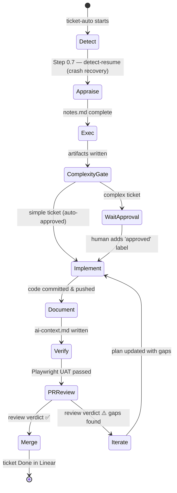

# ticket-auto

> Fully autonomous ticket pipeline — appraise, exec, implement, PR review, merge. Requires zero user input beyond the ticket ID. Stops only for complex tickets at the approve gate.

## What it does

`ticket-auto` is the top-level orchestrator for the entire ticket lifecycle. It accepts a single ticket ID, then drives every downstream skill in sequence — appraise, implement, verify, PR review, and merge — with no user interaction required. For complex tickets it pauses at the approval gate and waits for a human to add the `approved` label before continuing.

## Trigger

**Slash command:** `/ticket-auto <TICKET-ID>`

**Natural language:** "auto WIL-42", "process ticket WIL-42", "run ticket WIL-42 end to end"

## Inputs

| Input | Source | Required |
|-------|--------|----------|
| Ticket ID | CLI argument | Yes |
| `LINEAR_API_KEY` | Environment variable | Yes |
| `GITHUB_PERSONAL_ACCESS_TOKEN` | Environment variable | Yes |
| `REPOS_ROOT`, `LOCAL_URL`, `UAT_URL` | CLAUDE.md fields | Yes |

## Outputs / Artifacts

| Artifact | Location | Description |
|----------|----------|-------------|
| Pipeline log | `tickets/<ID>--slug/logs/pipeline.log` | Pipe-delimited event stream for every phase |
| Heartbeat log | `tickets/<ID>--slug/logs/heartbeat.log` | Decision and gate events |
| Per-phase agent logs | `tickets/<ID>--slug/logs/<phase>-agent.log` | Full agent transcript per phase |
| PR | GitHub | Opened and merged automatically on success |
| Linear state/labels | Linear issue | Updated at each pipeline gate |

## How it works

## Related skills

- [`/ticket-appraise`](ticket-appraise.md) — phase 1: investigation and complexity scoring
- [`/ticket-appraise-exec`](ticket-appraise-exec.md) — phase 2: artifact creation and Linear update
- [`/ticket-implement`](ticket-implement.md) — phase 3: code changes and PR
- [`/ticket-verify`](ticket-verify.md) — phase 4: Playwright UAT
- [`/ticket-pr-review`](ticket-pr-review.md) — phase 5: PR validation
- [`/ticket-detect-resume`](ticket-detect-resume.md) — crash recovery helper
- [`/ticket-flow`](ticket-flow.md) — all Linear state/label mutations
