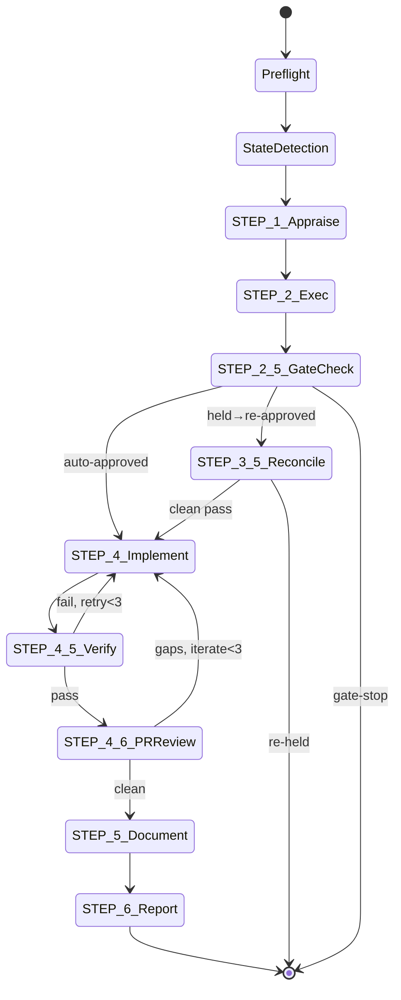

# ticket-auto

> Fully autonomous ticket pipeline — appraise, exec, implement, PR review, merge. Thin stateless router that dispatches to per-phase agents. No inline LLM reasoning between phases. Requires zero user input beyond the ticket ID. Stops only for complex tickets at the approve gate. Use when the user says "/ticket-auto <ID>", "auto <ID>", "process ticket <ID>", or "run ticket <ID> end to end".

## What it does

The orchestrator that drives the entire ticket lifecycle from Backlog to Done. It is a thin stateless router: reads pipeline log state via detect-resume.sh (direct bash invocation, not a Claude agent), dispatches named agent types for each phase, runs deterministic bash gates for approval and coherence checks, and manages retry loops for verification (up to 3 attempts) and PR iteration (up to 3 cycles). Every conditional between dispatches is a deterministic bash comparison -- zero inline LLM reasoning. All state lives in the pipeline log; the router re-reads it before every dispatch decision.

## Trigger

**Slash command:** `/ticket-auto <ID> [--auto|--semi-auto|--manual]`

**Natural language:** auto <ID>, process ticket <ID>, run ticket <ID> end to end

## Inputs

| Input | Source | Required |
|-------|--------|----------|
| Ticket ID | CLI argument | Yes |
| Autonomy mode | --auto/--semi-auto/--manual or TICKET_AUTONOMY env | No (defaults to manual) |
| LINEAR_API_KEY | Environment variable | Yes |
| REPOS_ROOT | CLAUDE.md | Yes |
| ISSUE_PREFIX | CLAUDE.md | Yes |
| CLAUDE.md fields | BE_SERVICES, WIKI_ROOT, UAT_URL, LOCAL_URL, etc. | No |

## Outputs / Artifacts

| Artifact | Location | Description |
|----------|----------|-------------|
| Pipeline log | ./logs/{ID}-pipeline.log | Full phase-by-phase event stream |
| Heartbeat log | ./logs/{ID}-heartbeat.log | Decisions, fallbacks, gate results |
| Agent output logs | ./logs/{ID}-{phase}-agent.log | Per-phase agent transcripts |
| Ticket workspace | {ticket-dir}/ | Complete investigation and implementation artifacts |
| Linear state | Linear | Ticket advanced through full lifecycle |

## How it works

## Related skills

- [`/ticket-appraise`](ticket-appraise.md) -- investigation phase agent
- [`/ticket-appraise-exec`](ticket-appraise-exec.md) -- artifact creation agent
- [`/ticket-implement`](ticket-implement.md) -- implementation phase agent
- [`/ticket-verify`](ticket-verify.md) -- Playwright UAT verification agent
- [`/ticket-pr-review`](ticket-pr-review.md) -- PR alignment review agent
- [`/ticket-flow`](ticket-flow.md) -- deterministic state machine executor
- [`/ticket-detect-resume`](ticket-detect-resume.md) -- pipeline log state parser (called as bash)
- [`/ticket-gate-reconcile`](ticket-gate-reconcile.md) -- post-hold comment reconciliation agent
