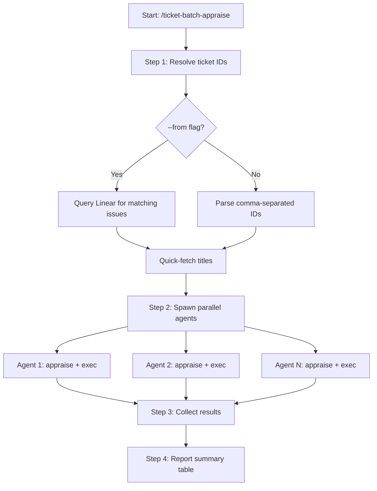

# ticket-batch-appraise

> Parallel appraisal + artifact creation for multiple Linear tickets. Spawns one agent per ticket -- each runs appraise then exec. Use when the user says "/ticket-batch-appraise <ID1>, <ID2>, ..." or "batch appraise these: <list>". Also supports Linear queries: "/ticket-batch-appraise --from project:<name> state:Backlog".

## What it does

Runs the full appraise-then-exec sequence for multiple tickets in parallel. Resolves ticket IDs from explicit lists or Linear queries (up to 10), quick-fetches titles for display, then spawns one agent per ticket in a single message. Each agent independently runs `/ticket-appraise` followed by `/ticket-appraise-exec`. The orchestrator collects results as agents return, reports a summary table with complexity, artifact type, and key findings, and notes any failures.

## Trigger

**Slash command:** `/ticket-batch-appraise <ID1>, <ID2>, ...` or `/ticket-batch-appraise --from project:<name> state:<state>`

**Natural language:** batch appraise these: <list>

## Inputs

| Input | Source | Required |
|-------|--------|----------|
| Ticket IDs or --from query | CLI argument | Yes |
| LINEAR_API_KEY | Environment variable | Yes |
| REPOS_ROOT | CLAUDE.md | Yes |
| ISSUE_PREFIX | CLAUDE.md | Yes |

## Outputs / Artifacts

| Artifact | Location | Description |
|----------|----------|-------------|
| Ticket workspaces | tickets/{ID}--slug/ | Per-ticket directories with notes.md and plan artifacts |
| Batch trace | tickets/batch-appraise-{timestamp}.md | Summary of all results |
| Linear state | Linear | All successful tickets -> Approve + claimed |

## How it works

## Related skills

- [`/ticket-appraise`](ticket-appraise.md) -- investigation phase run by each agent
- [`/ticket-appraise-exec`](ticket-appraise-exec.md) -- artifact creation run by each agent
- [`/ticket-batch-verify`](ticket-batch-verify.md) -- parallel UAT verification (complementary batch operation)
