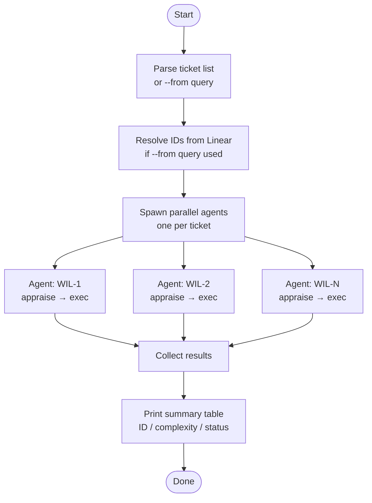

# ticket-batch-appraise

> Parallel appraisal and artifact creation for multiple Linear tickets. Spawns one agent per ticket — each runs appraise then exec. Reports a summary when all are done.

## What it does

`ticket-batch-appraise` accepts a list of ticket IDs (or a Linear query) and runs the full appraise → exec sequence for each ticket in parallel. Each ticket gets its own isolated agent so tickets do not interfere with each other. When all agents complete, it prints a summary table showing which tickets were appraised, their complexity scores, and any failures. Useful for processing a sprint backlog or a batch of newly triaged tickets.

## Trigger

**Slash command:** `/ticket-batch-appraise <ID1>, <ID2>, ...` or `/ticket-batch-appraise --from project:<name> state:Backlog`

**Natural language:** "batch appraise WIL-1, WIL-2, WIL-3", "appraise all backlog tickets in project X"

## Inputs

| Input | Source | Required |
|-------|--------|----------|
| Ticket IDs | CLI argument (comma-separated) | Yes (or `--from` query) |
| `--from` query | CLI flag | Yes (if no explicit IDs) |
| `LINEAR_API_KEY` | Environment variable | Yes |
| `REPOS_ROOT`, `ISSUE_PREFIX` | CLAUDE.md fields | Yes |

## Outputs / Artifacts

| Artifact | Location | Description |
|----------|----------|-------------|
| Per-ticket workspace | `tickets/<ID>--slug/` | One workspace per ticket (notes.md, context.md, plan) |
| Summary report | Stdout | Table of ticket → complexity → status for the batch |
| Linear updates | Each Linear issue | Same state/label updates as individual ticket-appraise-exec |

## How it works

## Related skills

- [`/ticket-appraise`](ticket-appraise.md) — what each spawned agent runs
- [`/ticket-appraise-exec`](ticket-appraise-exec.md) — second step each agent runs
- [`/ticket-batch-verify`](ticket-batch-verify.md) — parallel equivalent for UAT verification
