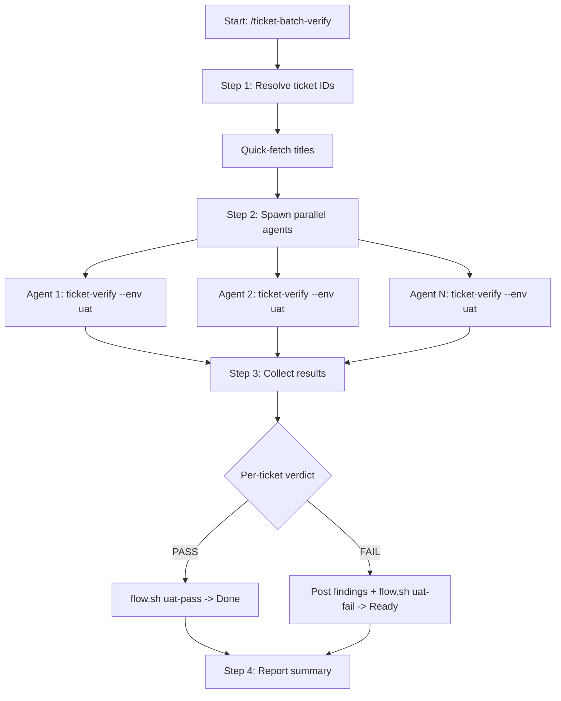

# ticket-batch-verify

> Parallel UAT verification for multiple Linear tickets. Spawns one agent per ticket -- each navigates UAT, confirms the fix against acceptance criteria, and reports PASS/FAIL. Use when the user says "/ticket-batch-verify <ID1>, <ID2>, ..." or "batch verify these: <list>". Also supports Linear queries: "/ticket-batch-verify --from project:<name> state:UAT".

## What it does

Runs UAT verification for multiple tickets in parallel. Resolves ticket IDs (up to 10), spawns one agent per ticket with `--env uat --from-auto` flags, and collects pass/fail results. Each agent auto-derives the test user from the ticket description and uses `admin` as the UAT password. On pass, automatically calls `uat-pass` to move the ticket to Done. On fail, posts findings to Linear and calls `uat-fail` to move back to Ready. UAT only -- no localhost support.

## Trigger

**Slash command:** `/ticket-batch-verify <ID1>, <ID2>, ...` or `/ticket-batch-verify --from state:UAT`

**Natural language:** batch verify these: <list>

## Inputs

| Input | Source | Required |
|-------|--------|----------|
| Ticket IDs or --from query | CLI argument | Yes |
| LINEAR_API_KEY | Environment variable | Yes |
| UAT_URL | CLAUDE.md | Yes |
| ISSUE_PREFIX | CLAUDE.md | Yes |

## Outputs / Artifacts

| Artifact | Location | Description |
|----------|----------|-------------|
| Batch trace | tickets/batch-verify-{timestamp}.md | Summary of all pass/fail results |
| Verification reports | Linear comments | Per-ticket pass/fail details |
| Linear state | Linear | PASS -> Done (uat-pass), FAIL -> Ready (uat-fail) |

## How it works

## Related skills

- [`/ticket-verify`](ticket-verify.md) -- individual UAT verification run by each agent
- [`/ticket-flow`](ticket-flow.md) -- state transitions (uat-pass, uat-fail)
- [`/ticket-batch-appraise`](ticket-batch-appraise.md) -- parallel appraisal (complementary batch operation)
