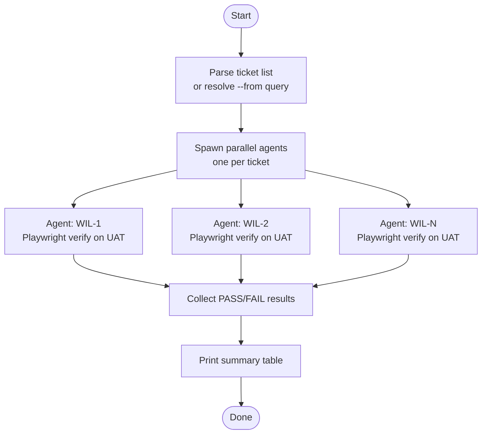

# ticket-batch-verify

> Parallel UAT verification for multiple Linear tickets. Spawns one agent per ticket — each navigates UAT, confirms the fix against acceptance criteria, and reports PASS/FAIL.

## What it does

`ticket-batch-verify` accepts a list of ticket IDs (or a Linear query for tickets in UAT state) and runs the full Playwright verification for each ticket simultaneously. Each ticket gets its own browser agent. Test credentials are derived from each ticket's description automatically. When all agents complete it prints a PASS/FAIL summary table. Failed tickets show their remediation brief for re-implementation.

## Trigger

**Slash command:** `/ticket-batch-verify <ID1>, <ID2>, ...` or `/ticket-batch-verify --from project:<name> state:UAT`

**Natural language:** "batch verify WIL-1, WIL-2", "verify all UAT tickets in project X"

## Inputs

| Input | Source | Required |
|-------|--------|----------|
| Ticket IDs | CLI argument (comma-separated) | Yes (or `--from` query) |
| `--from` query | CLI flag | Yes (if no explicit IDs) |
| `UAT_URL` | CLAUDE.md field | Yes |
| `LINEAR_API_KEY` | Environment variable | Yes |

## Outputs / Artifacts

| Artifact | Location | Description |
|----------|----------|-------------|
| Verify reports | Per-ticket pipeline logs | Structured PASS/FAIL per ticket |
| Summary table | Stdout | ID / verdict / remediation brief for failures |
| PRs | GitHub | One PR opened per PASS ticket |
| Linear state | Each Linear issue | `Done` (pass) or `In Progress` (fail) |

## How it works

## Related skills

- [`/ticket-verify`](ticket-verify.md) — what each spawned agent runs
- [`/ticket-batch-appraise`](ticket-batch-appraise.md) — parallel equivalent for appraisal
- [`/ticket-implement`](ticket-implement.md) — re-run for tickets that fail verification
