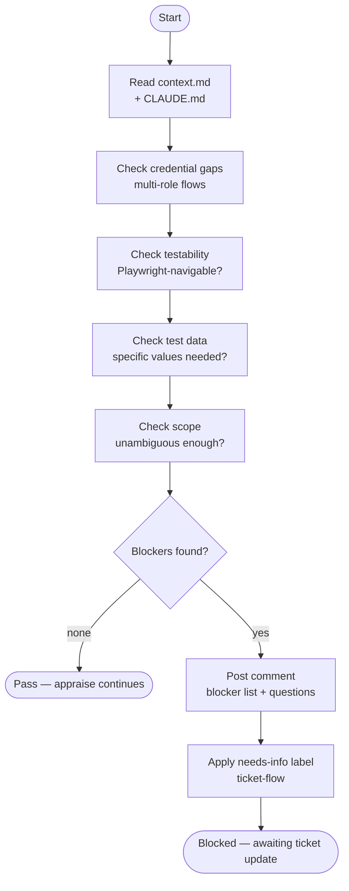

# ticket-critique

> Validates a Linear ticket's requirements for completeness before implementation begins. Checks for credential gaps, untestable criteria, missing test data, and scope ambiguity.

## What it does

`ticket-critique` reads a ticket's acceptance criteria and description, then checks for common blockers that would cause implementation or verification to fail: missing role credentials, acceptance criteria that cannot be tested by Playwright, absent test data, and scope that is too ambiguous to implement. If blockers are found it posts a Linear comment and applies the `needs-info` label so the ticket bounces back to the requester before any implementation work begins. Called automatically by `/ticket-appraise` at Step 2.7.

## Trigger

**Slash command:** `/ticket-critique <TICKET-ID>`

**Natural language:** "critique WIL-42", "validate requirements for WIL-42" (typically called internally by ticket-appraise)

## Inputs

| Input | Source | Required |
|-------|--------|----------|
| Ticket ID | CLI argument | Yes |
| `context.md` | Ticket workspace | Yes |
| `CLAUDE.md` | Project root | Yes (for known test users / environments) |

## Outputs / Artifacts

| Artifact | Location | Description |
|----------|----------|-------------|
| Linear comment | Linear issue | Blocker list with specific questions (only if blockers found) |
| `needs-info` label | Linear issue | Applied if blockers found |
| No-op | — | Silent pass if requirements are complete |

## How it works

## Related skills

- [`/ticket-appraise`](ticket-appraise.md) — calls this skill at Step 2.7
- [`/ticket-flow`](ticket-flow.md) — applies the `needs-info` label
