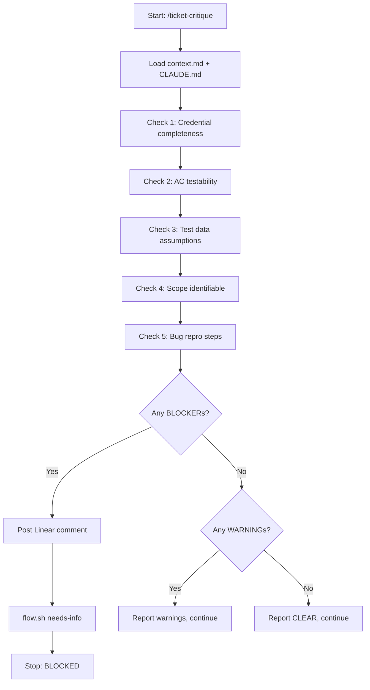

# ticket-critique

> Validates a Linear ticket's requirements for completeness before implementation begins. Checks for multi-role credential gaps, untestable acceptance criteria, missing test data, and scope ambiguity. Posts a Linear comment and adds `needs-info` label if blockers are found. Called automatically by ticket-appraise Step 2.7.

**Private helper** -- not intended for direct invocation. Called internally by [`/ticket-appraise`](ticket-appraise.md) at Step 2.7.

## What it does

Runs five completeness checks on a ticket before codebase investigation begins: multi-role credential completeness (are test credentials available for all required roles?), acceptance criteria testability (are ACs written as observable outcomes?), test data assumptions (is prerequisite state described?), scope identifiability (can the ticket be mapped to a known service?), and bug reproduction steps (are numbered steps present for bug tickets?). Classifies each finding as BLOCKER (must resolve) or WARNING (record and continue). On BLOCKER, posts a comment to Linear, adds the `needs-info` label, and halts the pipeline.

## Trigger

**Slash command:** `/ticket-critique <ID> [--from-appraise]`

**Natural language:** (called automatically by ticket-appraise)

## Inputs

| Input | Source | Required |
|-------|--------|----------|
| Ticket ID | CLI argument | Yes |
| context.md | {ticket-dir}/context.md | Yes |
| CLAUDE.md | Project root | Yes |
| --from-appraise flag | CLI | No |

## Outputs / Artifacts

| Artifact | Location | Description |
|----------|----------|-------------|
| Readiness Critique | notes.md (## Readiness Critique) | BLOCKED/WARNINGS/CLEAR status with findings |
| Linear comment | Linear ticket | Blocker details (if BLOCKED) |
| needs-info label | Linear | Applied on BLOCKER |

## How it works

## Related skills

- [`/ticket-appraise`](ticket-appraise.md) -- primary caller at Step 2.7
- [`/ticket-flow`](ticket-flow.md) -- needs-info label via flow.sh
