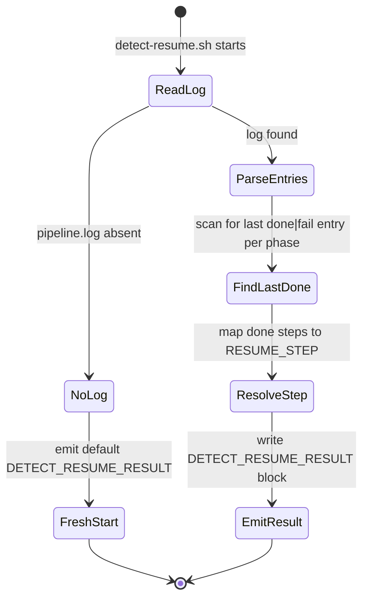

# ticket-detect-resume

> **Private helper** — not intended for direct invocation. Called internally by [`/ticket-auto`](ticket-auto.md) at Step 0.7 only.

Reads the pipeline log for a ticket, determines where the last run stopped, and emits a `DETECT_RESUME_RESULT` block so the orchestrator knows exactly where to restart — skipping phases that already completed.

## What it does

`ticket-detect-resume` is the crash-recovery mechanism that makes the pipeline restartable. Every time `/ticket-auto` starts (fresh or after a crash), it calls this skill first. The skill hands off to `detect-resume.sh`, which scans the pipeline log for the last `done` or `fail` entry in each phase and maps those entries to restart points. The result is an 18-field block telling the orchestrator which step to jump to and which `--from-step` flags to pass to each sub-skill — so re-runs pick up exactly where they left off rather than repeating completed work.

## Trigger

**Slash command:** `/ticket-detect-resume <TICKET-ID>` *(do not invoke directly)*

**Called by:** `/ticket-auto` Step 0.7

## Inputs

| Input | Source | Required |
|-------|--------|----------|
| Ticket ID | CLI argument | Yes |
| Pipeline log | `tickets/<ID>--slug/logs/pipeline.log` | Yes (must exist) |

## Outputs / Artifacts

| Artifact | Location | Description |
|----------|----------|-------------|
| `DETECT_RESUME_RESULT` block | Stdout | 18-field structured block consumed by ticket-auto |

Fields in the result: `RESUME_STEP`, `APPRAISE_FROM`, `REPRODUCE_FROM`, `EXEC_FROM`, `IMPLEMENT_FROM`, `MAINTENANCE_FROM`, `DOCUMENT_FROM`, `VERIFY_FROM`, `PR_REVIEW_FROM`, `PR_ITERATE_FROM`, `TICKET_DIR`, `COMPLEXITY`, `ARTIFACT_TYPE`, `BRANCH`, `TICKET_TITLE`, `VERIFY_ATTEMPTS`, `ITERATION`, `RECONCILE_CYCLE`, `PR_FEEDBACK_CYCLE`.

## How it works

## Related skills

- [`/ticket-auto`](ticket-auto.md) — the only caller of this skill
