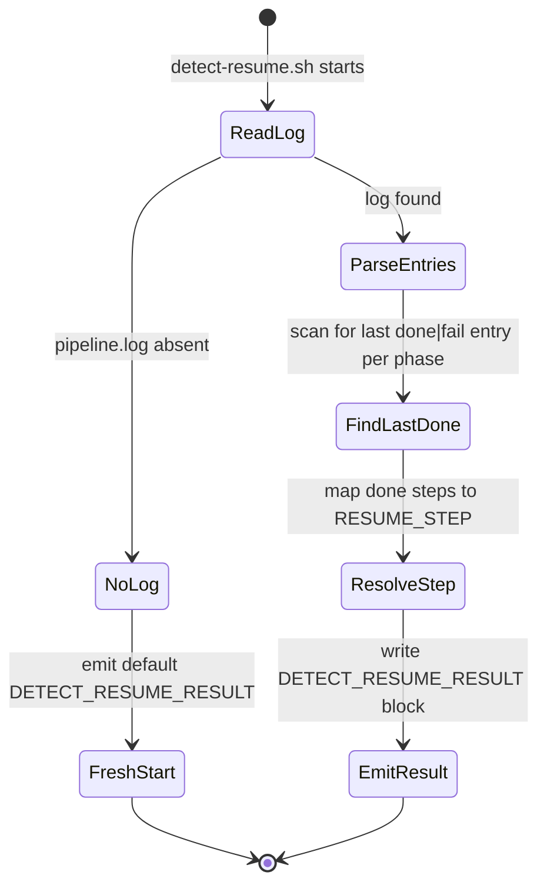

# ticket-detect-resume

> **Private helper** — not intended for direct invocation. Called internally by [`/ticket-auto`](ticket-auto.md) at Step 0.7 only.

Reads the pipeline log for a ticket, determines where the last run reached, and emits a `DETECT_RESUME_RESULT` block so the orchestrator can jump to the correct restart point.

## What it does

`ticket-detect-resume` is the crash recovery mechanism for the pipeline. When `/ticket-auto` starts, it calls this skill first. The skill delegates entirely to `detect-resume.sh`, which parses the pipeline log and identifies the last completed step. The result is a structured block with 18 fields — one resume point per pipeline phase — that the orchestrator uses to skip already-completed work and continue from the failure point.

## Trigger

**Slash command:** `/ticket-detect-resume <TICKET-ID>` *(do not invoke directly)*

**Called by:** `/ticket-auto` Step 0.7

## Inputs

| Input | Source | Required |
|-------|--------|----------|
| Ticket ID | CLI argument | Yes |
| Pipeline log | `tickets/<ID>--slug/logs/pipeline.log` | Yes (must exist) |

## Outputs / Artifacts

| Artifact | Location | Description |
|----------|----------|-------------|
| `DETECT_RESUME_RESULT` block | Stdout | 18-field structured block consumed by ticket-auto |

Fields in the result: `RESUME_STEP`, `APPRAISE_FROM`, `REPRODUCE_FROM`, `EXEC_FROM`, `IMPLEMENT_FROM`, `MAINTENANCE_FROM`, `DOCUMENT_FROM`, `VERIFY_FROM`, `PR_REVIEW_FROM`, `PR_ITERATE_FROM`, `TICKET_DIR`, `COMPLEXITY`, `ARTIFACT_TYPE`, `BRANCH`, `TICKET_TITLE`, `VERIFY_ATTEMPTS`, `ITERATION`, `RECONCILE_CYCLE`, `PR_FEEDBACK_CYCLE`.

## How it works

## Related skills

- [`/ticket-auto`](ticket-auto.md) — the only caller of this skill
