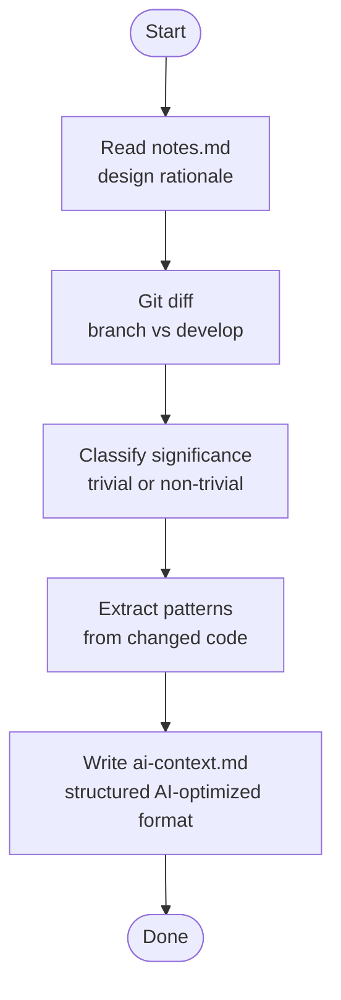

# ticket-document

> Generates ai-context.md after successful implementation. Diffs the branch, reads notes.md, classifies significance, and writes structured AI-optimized context to the ticket directory.

## What it does

`ticket-document` is a post-implementation step that captures institutional knowledge for future AI agents. It diffs the implementation branch against `develop`, reads `notes.md` for design rationale, classifies the change as trivial or non-trivial, and writes `ai-context.md` — a terse, structured file containing patterns discovered, decisions made, and file-level change summaries. Called automatically by `/ticket-auto` after implementation completes.

## Trigger

**Slash command:** `/ticket-document <TICKET-ID>`

**Natural language:** "document WIL-42", "generate ai-context for WIL-42" (typically called by ticket-auto)

## Inputs

| Input | Source | Required |
|-------|--------|----------|
| Ticket ID | CLI argument | Yes |
| `notes.md` | Ticket workspace | Yes |
| Git diff | Implementation branch vs `develop` | Yes |
| `$LOG_FILE` / `$HB_LOG_FILE` | Environment (set by ticket-auto) | No (only in pipeline context) |

## Outputs / Artifacts

| Artifact | Location | Description |
|----------|----------|-------------|
| `ai-context.md` | `tickets/<ID>--slug/` | AI-optimized: patterns, decisions, significance, changed files |

## How it works

## Related skills

- [`/ticket-implement`](ticket-implement.md) — runs before this skill
- [`/ticket-verify`](ticket-verify.md) — runs after this skill
- [`/ticket-auto`](ticket-auto.md) — orchestrator that drives this skill automatically
