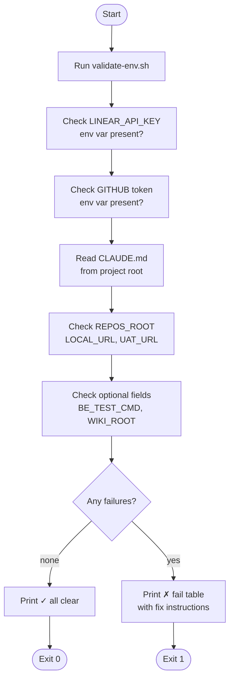

# ticket-env-check

> Validates all environment variables and CLAUDE.md fields required by the ticket-auto-pipeline. Run after first install or when pipeline commands fail with auth/configuration errors.

## What it does

`ticket-env-check` is the setup diagnostic skill. It runs `validate-env.sh` to verify that every required secret and project configuration field is present and well-formed: `LINEAR_API_KEY`, `GITHUB_PERSONAL_ACCESS_TOKEN`, and CLAUDE.md fields (`REPOS_ROOT`, `LOCAL_URL`, `UAT_URL`, and optional `BE_TEST_CMD`, `SLACK_CHANNEL`, `WIKI_ROOT`). It prints a pass/fail table and exits non-zero if any required item is missing — giving the user a clear fix list before attempting a full pipeline run.

## Trigger

**Slash command:** `/ticket-env-check`

**Natural language:** "check env", "validate pipeline config", "ticket-env-check"

## Inputs

| Input | Source | Required |
|-------|--------|----------|
| `LINEAR_API_KEY` | Environment variable | Yes |
| `GITHUB_PERSONAL_ACCESS_TOKEN` | Environment variable | Yes |
| `REPOS_ROOT` | CLAUDE.md field | Yes |
| `LOCAL_URL` | CLAUDE.md field | Yes |
| `UAT_URL` | CLAUDE.md field | Yes |
| `BE_TEST_CMD` | CLAUDE.md field | No |
| `SLACK_CHANNEL` | CLAUDE.md field | No |
| `WIKI_ROOT` | CLAUDE.md field | No |

## Outputs / Artifacts

| Artifact | Location | Description |
|----------|----------|-------------|
| Validation report | Stdout | Pass/fail table per required item |
| Exit code | Process | Non-zero if any required item is missing |

## How it works

## Related skills

- [`/ticket-auto`](ticket-auto.md) — runs validate-env internally as its first guard
