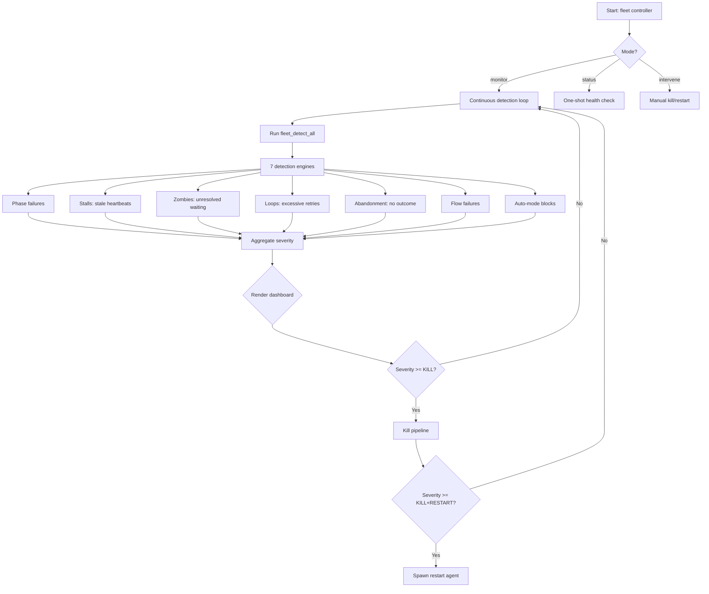

# ticket-fleet-controller

> Monitors all active ticket-auto pipelines using 6 detection engines (phase failures, stalls, zombies, loops, abandonment, flow failures) and escalates autonomously through OBSERVE -> WARN -> KILL -> KILL+RESTART severity levels. All interventions execute through fleet lib functions -- no silent mutations outside the declared tool set. In interactive mode (CLAUDE_CODE_SESSION_ID set), spawns restart agents via the Agent tool for KILL+RESTART actions; in cron mode, writes to the spawn queue JSONL for deferred processing.

## What it does

Automated circuit breaker for the ticket-auto pipeline. Runs continuous detection against all active pipelines: phase failures (`|fail|` entries), stalls (stale heartbeats), zombies (unresolved `|waiting|`), loops (excessive retries), abandonment (no outcome after threshold), and flow failures (flow.sh retry events). Escalates through four severity levels based on configurable time/count thresholds. At KILL level, touches stop files to terminate pingers and watchdogs. At KILL+RESTART, spawns a fresh `/ticket-auto` agent if within max restart count.

## Trigger

**Slash command:** `/ticket-fleet-controller <monitor|status|intervene <ID>>`

**Natural language:** (invoked as slash command)

## Inputs

| Input | Source | Required |
|-------|--------|----------|
| Mode | CLI (monitor, status, or intervene) | Yes |
| Ticket ID | CLI (for intervene mode) | Only for intervene |
| Pipeline logs | ./logs/*-pipeline.log | Yes |
| Heartbeat logs | ./logs/*-heartbeat.log | Yes |
| FLEET_POLL_INTERVAL | Environment variable (default: 30) | No |
| FLEET_AUTO_RESTART | Environment variable (default: false) | No |
| FLEET_DRY_RUN | Environment variable (default: false) | No |

## Outputs / Artifacts

| Artifact | Location | Description |
|----------|----------|-------------|
| Terminal dashboard | stdout | Health table with severity and anomalies |
| Fleet report | ./logs/reports/fleet-dashboard.md | Markdown report with alerts + diagnostics |
| Stop files | /tmp/ticket-auto-{ID}-pinger-stop | Pipeline kill signals |
| Restart agents | Agent spawn (interactive) or JSONL queue (cron) | Fresh pipeline spawns |
| Audit entries | Heartbeat log | `decision|fleet-kill|fired`, `decision|fleet-restart|fired` |

## How it works

## Related skills

- [`/ticket-overseer`](ticket-overseer.md) -- human-facing dashboard (complementary)
- [`/ticket-detect-resume`](ticket-detect-resume.md) -- crash recovery from pipeline log
- [`/ticket-retro`](ticket-retro.md) -- post-hoc failure pattern analysis
