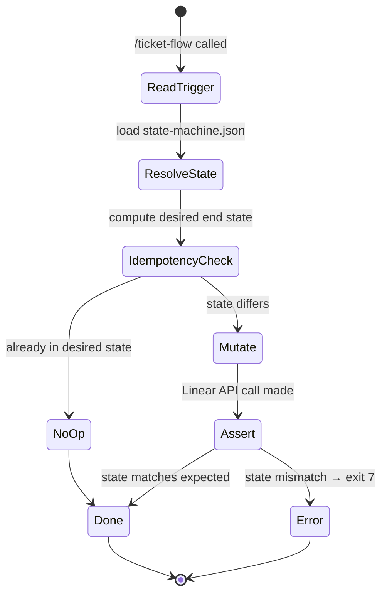

# ticket-flow

> Centralized Linear state/label executor. Every pipeline skill delegates state transitions and label changes here — no skill calls Linear for mutations directly.

## What it does

`ticket-flow` is the single point of truth for all Linear mutations in the pipeline. Skills never call Linear state or label endpoints directly — they invoke `/ticket-flow` with a trigger name and optional data. `ticket-flow` reads `state-machine.json` to resolve the correct state, labels to add/remove, and expected post-state, then calls `flow.sh` to execute the mutation idempotently. After every mutation it re-fetches the issue and asserts the result matches expectations (exit 7 on mismatch).

## Trigger

**Slash command:** `/ticket-flow <TICKET-ID> <TRIGGER> [--data key=value] [--dry-run]`

**Natural language:** Not user-facing — called internally by all pipeline skills.

## Inputs

| Input | Source | Required |
|-------|--------|----------|
| Ticket ID | CLI argument | Yes |
| Trigger name | CLI argument | Yes |
| `--data` key=value pairs | CLI flags | Trigger-dependent |
| `--dry-run` | CLI flag | No |
| `LINEAR_API_KEY` | Environment variable | Yes |
| `state-machine.json` | Plugin root | Yes |

## Outputs / Artifacts

| Artifact | Location | Description |
|----------|----------|-------------|
| Linear state | Linear issue | Transitioned to the state defined by the trigger |
| Linear labels | Linear issue | Labels added/removed per state machine definition |
| Post-trigger assertion | Exit code | Exit 7 if resulting state does not match expectations |

## How it works

## Related skills

- [`/ticket-auto`](ticket-auto.md) — orchestrator; all phase transitions go via ticket-flow
- [`/ticket-appraise-exec`](ticket-appraise-exec.md) — triggers: `appraised`, complexity label
- [`/ticket-implement`](ticket-implement.md) — triggers: `in-progress`, `in-review`
- [`/ticket-verify`](ticket-verify.md) — triggers: `uat`, PR open
- [`/ticket-pr-review`](ticket-pr-review.md) — triggers: `merge`, `needs-work`
