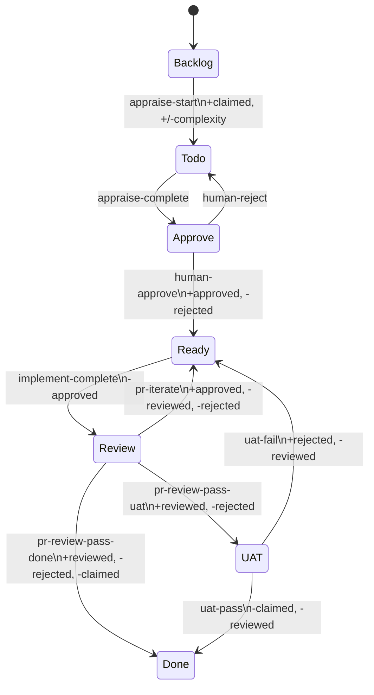

# ticket-flow

> ticket-flow

**Private helper** -- not intended for direct invocation. Called internally by every pipeline skill that mutates Linear state.

## What it does

Centralized Linear state and label executor. Wraps the deterministic `flow.sh` bash script which reads the state machine definition from `state-machine.json`, computes the desired end state from current state plus requested additions and removals, and calls the Linear API only when a mutation is needed. Provides idempotency (no-op if nothing would change) and post-trigger assertions (re-fetches issue, exits 7 on mismatch). Every pipeline skill delegates state transitions and label changes here -- no skill calls Linear mutation endpoints directly.

## Trigger

**Slash command:** `/ticket-flow <TICKET-ID> <TRIGGER> [--data key=value] [--dry-run]`

**Natural language:** (called programmatically by other skills)

## Inputs

| Input | Source | Required |
|-------|--------|----------|
| Ticket ID | CLI argument | Yes |
| Trigger name | CLI argument (e.g. appraise-start, implement-complete) | Yes |
| --data | CLI (trigger-specific values like complexity=simple) | No |
| --dry-run | CLI (preview without mutation) | No |
| LINEAR_API_KEY | Environment variable | Yes |
| state-machine.json | Plugin directory | Yes |

## Outputs / Artifacts

| Artifact | Location | Description |
|----------|----------|-------------|
| State transition | Linear | Ticket state changed per state machine rules |
| Label changes | Linear | Labels added/removed per transition definition |
| Assignee change | Linear | Assignee set on appraise-start |
| Sentinel file | ~/.claude/state/ticket-flow/validated-{TEAM_ID} | Config validation cache |

## How it works

## Related skills

- [`/ticket-auto`](ticket-auto.md) -- orchestrator that calls flow.sh at multiple dispatch points
- [`/ticket-appraise`](ticket-appraise.md) -- calls appraise-start trigger
- [`/ticket-appraise-exec`](ticket-appraise-exec.md) -- calls appraise-complete trigger
- [`/ticket-implement`](ticket-implement.md) -- calls implement-outcome and implement-complete
- [`/ticket-verify`](ticket-verify.md) -- calls uat-pass, uat-fail, and implement-complete
