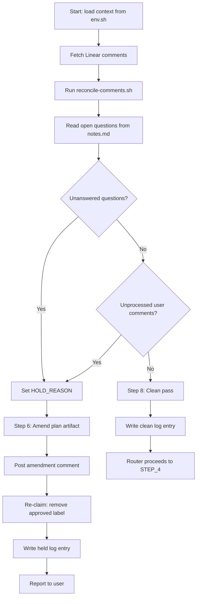

# ticket-gate-reconcile

> Post-gate-hold comment reconciliation agent. Spawned when a held ticket is re-approved. Fetches Linear comments, evaluates open questions, incorporates user guidance into the plan artifact, and either passes clean or re-holds with an amendment cycle. Extracted from ticket-auto Step 3.5.

**Private helper** — not intended for direct invocation. Called internally by [`/ticket-auto`](ticket-auto.md) at STEP_3_5 when a held ticket receives the approved label.

## What it does

When a complex ticket was held at the gate and a human later adds the `approved` label, this agent reconciles any new Linear comments against the plan artifact. It checks two hold conditions: unanswered open questions from notes.md, and unprocessed user comments from the hold window. If either triggers, it amends the plan with an `## Amendment #N` section and re-holds the ticket. If both are clear, it writes a clean pass log entry and the router proceeds to implementation.

## Trigger

**Slash command:** `/ticket-gate-reconcile <ID>` (spawned by ticket-auto)

**Natural language:** (called programmatically by the thin router)

## Inputs

| Input | Source | Required |
|-------|--------|----------|
| Ticket ID | From router spawn instruction | Yes |
| /tmp/ticket-auto-{ID}-env.sh | Written by router Step 0.5 | Yes |
| Pipeline log | ./logs/{ID}-pipeline.log | Yes |
| Heartbeat log | ./logs/{ID}-heartbeat.log | Yes |
| notes.md | {ticket-dir}/notes.md | Yes |
| Plan artifact | {ticket-dir}/simple-fix.md or openspec tasks.md | Yes |
| LINEAR_API_KEY | Environment variable | Yes |

## Outputs / Artifacts

| Artifact | Location | Description |
|----------|----------|-------------|
| Amendment section | Plan artifact (## Amendment #N) | Incorporated user feedback |
| Updated open questions | notes.md (## Open Questions) | Resolved questions struck through |
| Amendment comment | Linear ticket | Summary of changes and open questions |
| Clean pass or re-hold | Pipeline log | GATE\|reconcile\|done\|clean or held |

## How it works

## Related skills

- [`/ticket-auto`](ticket-auto.md) — thin router that spawns this agent at STEP_3_5
- [`/ticket-implement`](ticket-implement.md) — consumes the amended plan artifact
- [`/ticket-flow`](ticket-flow.md) — re-claim trigger for hold state
