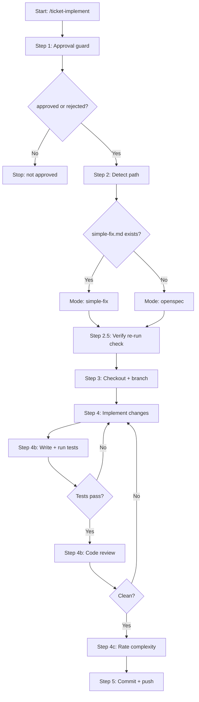

# ticket-implement

> Full implementation workflow for a Linear ticket that has been approved. Loads the ticket workspace, moves to Ready, sets up branches on affected repos, runs the implementation (simple-fix or openspec), commits, and pushes. PR creation and close-out are gated by /ticket-verify. Use when the user says "/ticket-implement <ID>", "implement ticket <ID>", "start implementing <ID>", or "work on <ID>" after appraisal/approval is done.

## What it does

Executes the implementation plan produced during appraisal. Checks the approval guard (requires `approved` or `rejected` label for UAT rework), identifies the implementation path (simple-fix.md for simple tickets, openspec change for complex), creates branches on all affected repos (branching from develop), runs the code changes, writes and runs tests, performs code review via spawned agent, rates actual complexity against the prediction (Smooth/Rough/Hard), and commits/pushes. Handles verification re-runs by reading remediation briefs from prior failures and appending verification sections to the plan.

## Trigger

**Slash command:** `/ticket-implement <ID>`

**Natural language:** implement ticket <ID>, start implementing <ID>, work on <ID>

## Inputs

| Input | Source | Required |
|-------|--------|----------|
| Ticket ID | CLI argument | Yes |
| notes.md | {ticket-dir}/notes.md | Yes |
| context.md | {ticket-dir}/context.md | Yes |
| Plan artifact | simple-fix.md or openspec tasks.md | Yes |
| LINEAR_API_KEY | Environment variable | Yes |
| REPOS_ROOT | CLAUDE.md | Yes |
| BE_TEST_CMD | CLAUDE.md | No |
| FE_TEST_CMD | CLAUDE.md | No |
| --from-auto flag | CLI (set by ticket-auto) | No |
| --from-step flag | CLI (crash recovery) | No |

## Outputs / Artifacts

| Artifact | Location | Description |
|----------|----------|-------------|
| Code changes | Affected repos | Implemented fix on feature branch |
| Unit tests | Affected repos | New/modified tests for changed logic |
| Outcome label | Linear | Smooth/Rough/Hard applied |
| Commit + push | Remote branch | Changes pushed to origin |
| Wiki errata | WIKI_ROOT flow files | Errata appended on complexity mismatch |
| Feedback memory | claude-mem | Pattern recorded for mismatch analysis |

## How it works

## Related skills

- [`/ticket-appraise`](ticket-appraise.md) -- produces the investigation notes consumed here
- [`/ticket-appraise-exec`](ticket-appraise-exec.md) -- produces the plan artifact consumed here
- [`/ticket-verify`](ticket-verify.md) -- UAT verification that may trigger re-implementation
- [`/ticket-pr-review`](ticket-pr-review.md) -- PR alignment review after verification
- [`/ticket-flow`](ticket-flow.md) -- outcome label and state transitions
