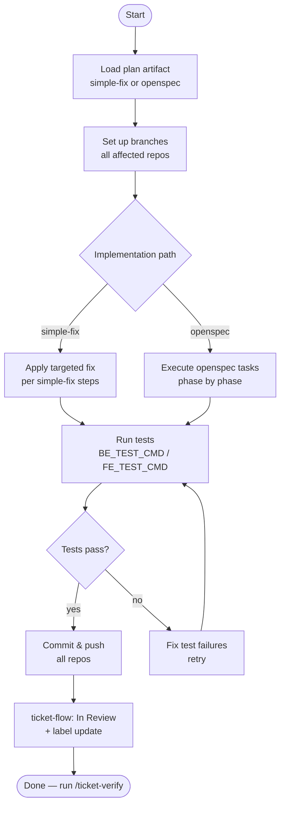

# ticket-implement

> Full implementation workflow for an approved Linear ticket. Loads the workspace, sets up branches, runs the implementation, commits, and pushes. PR creation is gated by /ticket-verify.

## What it does

`ticket-implement` executes the code changes for a ticket that has been appraised and approved. It reads the plan artifact (simple-fix or openspec), sets up feature branches across all affected repos, makes the required code changes, runs tests, commits, and pushes. It does not create the PR — that happens after verification passes. If the implementation involves wiki call chains, it appends errata entries for gaps found during the work.

## Trigger

**Slash command:** `/ticket-implement <TICKET-ID>`

**Natural language:** "implement ticket WIL-42", "start implementing WIL-42", "work on WIL-42"

## Inputs

| Input | Source | Required |
|-------|--------|----------|
| Ticket ID | CLI argument | Yes |
| Plan artifact | `tickets/<ID>--slug/simple-fix.md` or `plan.md` | Yes |
| `REPOS_ROOT` | CLAUDE.md field | Yes |
| `BE_TEST_CMD` | CLAUDE.md field | No (skips test run if absent) |
| `FE_TEST_CMD` | CLAUDE.md field | No |
| `LINEAR_API_KEY` | Environment variable | Yes |

## Outputs / Artifacts

| Artifact | Location | Description |
|----------|----------|-------------|
| Feature branches | Each affected repo | `<ID>--slug` branch pushed to origin |
| Code changes | Affected repos | All changes committed per plan |
| Wiki errata | `WIKI_ROOT/<flow-file>.md` | Gap entries appended if wiki mismatches found |
| Linear state | Linear issue | Transitioned to `In Progress` → `In Review` |

## How it works

## Related skills

- [`/ticket-appraise-exec`](ticket-appraise-exec.md) — creates the plan artifact this skill reads
- [`/ticket-verify`](ticket-verify.md) — next step: validates the implementation via Playwright
- [`/ticket-pr-iterate`](ticket-pr-iterate.md) — reruns this skill after PR review gaps are addressed
- [`/ticket-auto`](ticket-auto.md) — orchestrator that drives this skill automatically
