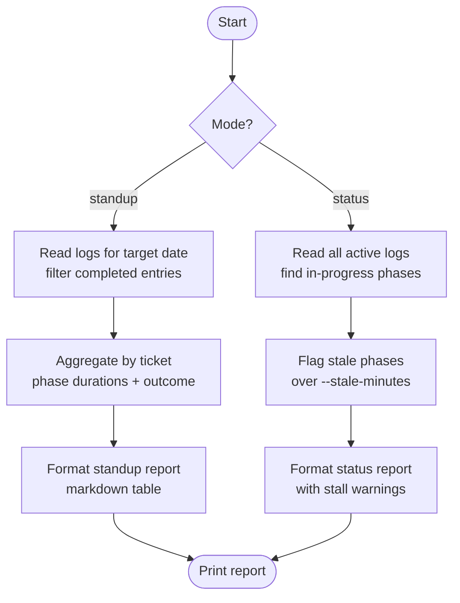

# ticket-overseer

> **Private helper** — not intended for direct invocation by users. Called internally by the pipeline observability layer.

Observability layer for the ticket-auto pipeline. Reads pipeline logs and session traces to produce standup reports (retrospective) and status reports (in-flight progress).

## What it does

`ticket-overseer` is the reporting and observability skill. It reads `pipeline.log` files and `auto-session.md` traces across all ticket workspaces and produces two report types: a **standup** report summarising what completed yesterday (or on a given date), and a **status** report showing what is currently in-flight, including stall detection for phases that have been running too long. It does not modify any state — it is purely read-only.

## Trigger

**Slash command:**
- `/ticket-overseer standup [--date YYYY-MM-DD]`
- `/ticket-overseer status [--stale-minutes N]`

**Natural language:** "standup report", "what's the pipeline status", "overseer status"

## Inputs

| Input | Source | Required |
|-------|--------|----------|
| Mode (`standup` / `status`) | CLI argument | Yes |
| `--date` | CLI flag | No (standup mode; default: yesterday) |
| `--stale-minutes` | CLI flag | No (status mode; default: 15) |
| Pipeline logs | `tickets/*/logs/*.log` | Yes |
| Session traces | `tickets/**/auto-session.md` | Yes |
| Complexity notes | `tickets/**/notes.md` | No |

## Outputs / Artifacts

| Artifact | Location | Description |
|----------|----------|-------------|
| Standup report | Stdout | Yesterday's completed tickets, failures, and time-per-phase |
| Status report | Stdout | In-flight tickets with current phase and stall warnings |

## How it works

## Related skills

- [`/ticket-auto`](ticket-auto.md) — generates the pipeline logs this skill reads
- [`/ticket-retro`](ticket-retro.md) — retrospective fix proposals (complements standup view)
