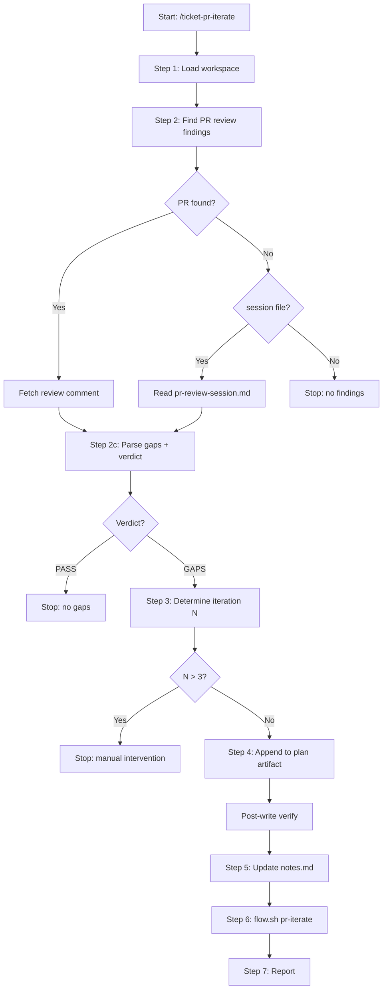

# ticket-pr-iterate

> Incorporates PR review findings back into the implementation plan. Reads the ticket-pr-review comment (or pr-review-session.md), parses gap items, appends a versioned PR Review #N section to the plan artifact, and resets Linear state so ticket-implement can pick up the changes. Use when the user says "/ticket-pr-iterate <ID>", "iterate on PR feedback for <ID>", or "fix review gaps for <ID>".

## What it does

Bridges the gap between PR review and re-implementation. Locates the PR review findings (from the GitHub PR comment or local session file), parses gap items with their requirement numbers and statuses, determines the iteration number, and appends a structured `## PR Review #N` section to the plan artifact (simple-fix.md or openspec tasks.md). Each gap includes a concrete "What needs to change" derived from the requirement and suggested fix. Updates Linear state to Ready with approved label so ticket-implement can process the gaps in a new round.

## Trigger

**Slash command:** `/ticket-pr-iterate <ID>`

**Natural language:** iterate on PR feedback for <ID>, fix review gaps for <ID>

## Inputs

| Input | Source | Required |
|-------|--------|----------|
| Ticket ID | CLI argument | Yes |
| context.md | {ticket-dir}/context.md | Yes |
| notes.md | {ticket-dir}/notes.md | Yes |
| Plan artifact | simple-fix.md or openspec tasks.md | Yes |
| PR review comment | GitHub PR (via gh pr view) | Yes (falls back to pr-review-session.md) |
| LINEAR_API_KEY | Environment variable | No (only for flow.sh) |
| --from-auto flag | CLI (set by ticket-auto) | No |
| --from-step flag | CLI (crash recovery) | No |

## Outputs / Artifacts

| Artifact | Location | Description |
|----------|----------|-------------|
| PR Review #N section | Plan artifact | Structured gaps with implementation steps |
| notes.md update | {ticket-dir}/notes.md | Session log entry |
| Linear state | Linear | Ready + approved, reviewed/rejected cleared |
| pr-iterate-session.md | {ticket-dir}/pr-iterate-session.md | Session trace file |

## How it works

## Related skills

- [`/ticket-pr-review`](ticket-pr-review.md) -- produces the review findings consumed here
- [`/ticket-implement`](ticket-implement.md) -- processes the gaps in a new implementation round
- [`/ticket-flow`](ticket-flow.md) -- resets Linear state via pr-iterate trigger
