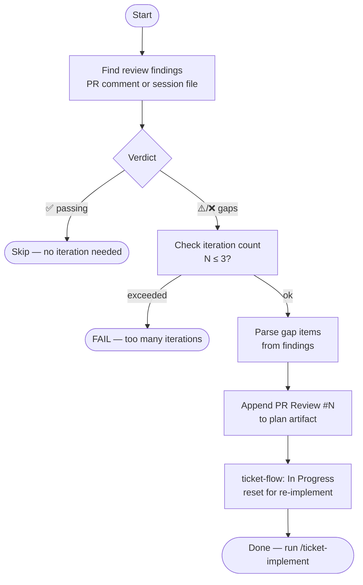

# ticket-pr-iterate

> Incorporates PR review findings back into the implementation plan. Reads gap items, appends a versioned PR Review section to the plan, and resets Linear state for a new implementation round.

## What it does

`ticket-pr-iterate` closes the feedback loop between PR review and re-implementation. It reads the gap items from the PR review comment (or local `pr-review-session.md`), appends a versioned `## PR Review #N` section to the ticket's plan artifact, then transitions Linear back to `In Progress` so `/ticket-implement` can pick up the changes. It guards against excessive loops (>3 iterations) and skips iteration if the review verdict is already passing.

## Trigger

**Slash command:** `/ticket-pr-iterate <TICKET-ID>`

**Natural language:** "iterate on PR feedback for WIL-42", "fix review gaps for WIL-42"

## Inputs

| Input | Source | Required |
|-------|--------|----------|
| Ticket ID | CLI argument | Yes |
| PR review comment or `pr-review-session.md` | GitHub PR / ticket workspace | Yes |
| Plan artifact | `tickets/<ID>--slug/simple-fix.md` or `plan.md` | Yes |
| `REPOS_ROOT` | CLAUDE.md field | Yes |

## Outputs / Artifacts

| Artifact | Location | Description |
|----------|----------|-------------|
| Updated plan artifact | `tickets/<ID>--slug/` | `## PR Review #N` section appended with gap tasks |
| Linear state | Linear issue | Reset to `In Progress` for re-implementation |

## How it works

## Related skills

- [`/ticket-pr-review`](ticket-pr-review.md) — produces the gap findings this skill reads
- [`/ticket-implement`](ticket-implement.md) — re-runs after this skill updates the plan
- [`/ticket-auto`](ticket-auto.md) — orchestrator that manages the iterate → implement → review loop
