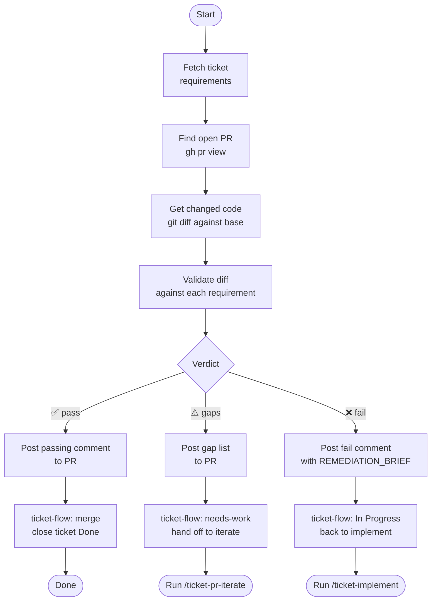

# ticket-pr-review

> Reviews a pull request by extracting requirements from its Linear ticket, validating changed code against those requirements, and posting findings to the PR.

## What it does

`ticket-pr-review` performs a requirements-traceability review of an open PR. It fetches the ticket's acceptance criteria, finds the associated PR, diffs the changed code, and validates that each requirement is addressed. It posts a structured comment to the PR with a verdict (✅ pass / ⚠️ gaps / ❌ fail) and a list of any gaps. If the verdict is clear, it triggers the merge; if gaps exist, it hands off to `/ticket-pr-iterate`.

## Trigger

**Slash command:** `/ticket-pr-review <TICKET-ID>`

**Natural language:** "review PR for WIL-42", "verify WIL-42 against ticket", "check PR for WIL-42"

## Inputs

| Input | Source | Required |
|-------|--------|----------|
| Ticket ID | CLI argument | Yes |
| `LINEAR_API_KEY` | Environment variable | Yes |
| `GITHUB_PERSONAL_ACCESS_TOKEN` | Environment variable | Yes |
| `REPOS_ROOT` | CLAUDE.md field | Yes |

## Outputs / Artifacts

| Artifact | Location | Description |
|----------|----------|-------------|
| PR review comment | GitHub PR | Structured verdict with requirement gaps listed |
| `pr-review-session.md` | Ticket workspace | Local copy of findings for iterate skill |
| Linear state | Linear issue | `Done` (pass) or `In Review` with `needs-work` label (gaps) |
| Merged PR | GitHub | PR merged on ✅ verdict |

## How it works

## Related skills

- [`/ticket-verify`](ticket-verify.md) — runs before this skill; opens the PR this skill reviews
- [`/ticket-pr-iterate`](ticket-pr-iterate.md) — next step when gaps are found
- [`/ticket-flow`](ticket-flow.md) — handles merge and state transitions
- [`/ticket-auto`](ticket-auto.md) — orchestrator that drives this skill automatically
