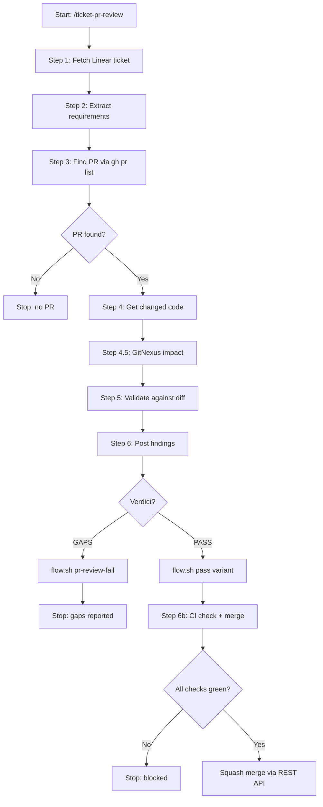

# ticket-pr-review

> Reviews a pull request by extracting requirements from its Linear ticket, validating the changed code against those requirements, and posting findings to the PR. Use when the user says "/ticket-pr-review <TICKET-ID>", "review PR for <TICKET-ID>", or "verify <TICKET-ID> against ticket".

## What it does

Performs a ticket-alignment review of a pull request. Fetches the Linear ticket to extract requirements, finds the associated PR via `gh pr list`, diffs the branch against its base, validates each requirement against the actual code changes, runs GitNexus structural impact analysis, and posts a coverage table as a GitHub comment. On pass, checks CI status, scans for conflict markers, and merges via REST API. On gaps, posts findings and applies the `rejected` label so ticket-pr-iterate can bridge to re-implementation.

## Trigger

**Slash command:** `/ticket-pr-review <TICKET-ID>`

**Natural language:** review PR for <TICKET-ID>, verify <TICKET-ID> against ticket

## Inputs

| Input | Source | Required |
|-------|--------|----------|
| Ticket ID | CLI argument | Yes |
| LINEAR_API_KEY | Environment variable | Yes |
| GitHub token | gh CLI / GITHUB_PERSONAL_ACCESS_TOKEN | Yes |
| REPOS_ROOT | CLAUDE.md | Yes |
| --from-auto flag | CLI (set by ticket-auto) | No |
| --from-step flag | CLI (crash recovery) | No |

## Outputs / Artifacts

| Artifact | Location | Description |
|----------|----------|-------------|
| Review comment | GitHub PR | Requirements coverage table + verdict |
| Linear label | Linear | reviewed or rejected applied |
| PR merge | GitHub | Squash merge via REST API (on pass) |
| pr-review-session.md | {ticket-dir}/pr-review-session.md | Session trace file |

## How it works

## Related skills

- [`/ticket-pr-iterate`](ticket-pr-iterate.md) -- incorporates gap findings back into the plan
- [`/ticket-implement`](ticket-implement.md) -- produces the PR being reviewed
- [`/ticket-flow`](ticket-flow.md) -- applies reviewed/rejected label via flow.sh
