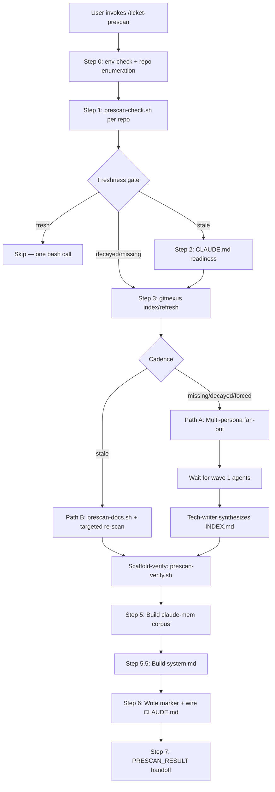

# ticket-prescan

> Pre-scan a repository to build durable agent-knowledge artifacts under REPOS_ROOT/.ticket-auto/. Runs freshness gate, gitnexus indexing, multi-persona fan-out or incremental refresh, and corpus building. Produces per-repo docs consumed by ticket-appraise Step 3a.

## What it does

Builds durable, freshness-tracked agent-knowledge docs per repo under `REPOS_ROOT/.ticket-auto/<repo-slug>/docs/`. A multi-persona agent fan-out produces distilled docs once; subsequent runs verify freshness deterministically via `prescan-check.sh` and only re-scan what changed. This replaces per-ticket codebase rediscovery with pre-built, verified knowledge — reducing appraise token costs and improving consistency.

Call manually via `/ticket-prescan [path]` or auto-invoked by the ticket-auto router before Step 1 when prescan docs are stale or missing.

## Trigger

**Slash command:** `/ticket-prescan [repo-path] [--force] [--with-qa]`

**Natural language:** prescan the repos, build agent knowledge, scan repo for pipeline, pre-scan codebase

## Inputs

| Input | Source | Required |
|-------|--------|----------|
| Repo path | User argument or REPOS_ROOT enumeration | No (defaults to all repos under REPOS_ROOT) |
| `REPOS_ROOT` | CLAUDE.md field | Yes |
| `--force` | Flag — bypass freshness gate | No |
| `--with-qa` | Flag — include qa-engineer persona | No |
| gitnexus MCP | MCP server | No (graceful degradation) |
| claude-mem MCP | MCP server | No (Tier 2 corpus fallback unavailable) |

## Outputs / Artifacts

| Artifact | Location | Description |
|----------|----------|-------------|
| `meta.json` | `.ticket-auto/<slug>/meta.json` | Freshness marker: SHA, timestamps, schema version, scan count |
| `overview.md` | `.ticket-auto/<slug>/docs/overview.md` | Architecture overview (architect persona) |
| `processes.md` | `.ticket-auto/<slug>/docs/processes.md` | Execution flows and call chains (analyzer persona) |
| `security-surfaces.md` | `.ticket-auto/<slug>/docs/security-surfaces.md` | Auth surfaces, PII locations (security persona) |
| `services/*.md` | `.ticket-auto/<slug>/docs/services/` | Per-service docs (deterministic distiller) |
| `routes.md` | `.ticket-auto/<slug>/docs/routes.md` | API route table (deterministic distiller) |
| `INDEX.md` | `.ticket-auto/<slug>/docs/INDEX.md` | Lookup by Topic/Service tables (technical-writer) |
| `system.md` | `.ticket-auto/system.md` | Cross-repo FE→BE contract map |
| CLAUDE.md block | Repo `CLAUDE.md` | Managed `<!-- ticket-auto:agent-knowledge -->` block |

## How it works

## Deterministic scripts (zero LLM tokens)

| Script | Purpose |
|--------|---------|
| `prescan-check.sh` | Freshness gate — missing marker, schema version, integrity, SHA ancestry, source changes, decay detection |
| `prescan-docs.sh` | Graph→markdown distiller — gitnexus JSON to `services/*.md`, `routes.md`, `processes.md`, `INDEX.md` |
| `prescan-route.sh` | INDEX.md keyword→file router — deterministic keyword matching for appraise Tier 1 consumption |
| `prescan-verify.sh` | Post-scan quality assertions — file existence, content quality, security warning, INDEX.md tables |
| `prescan-wire-claude-md.sh` | Managed block injection — idempotent CLAUDE.md `<!-- ticket-auto:agent-knowledge -->` block |

## Related skills

- [`/ticket-appraise`](ticket-appraise.md) — consumes prescan docs in Step 3a (Tier 1: INDEX.md routing, Tier 2: corpus fallback, Tier 3: wiki)
- [`/ticket-auto`](ticket-auto.md) — auto-invokes prescan before Step 1 if docs are stale/missing
- [`/ticket-setup`](ticket-setup.md) — Step 0 env-check and repo enumeration reused by prescan
