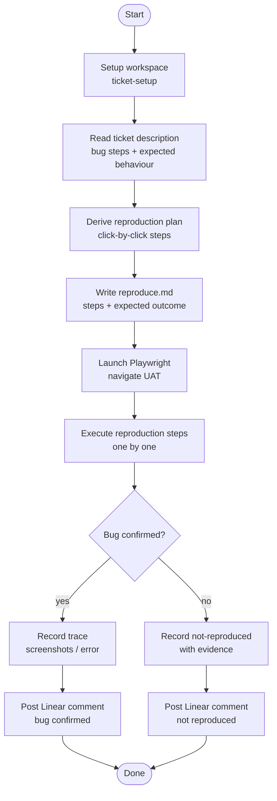

# ticket-reproduce

> Derives a concrete browser reproduction plan from a Linear ticket, writes it to reproduce.md, then navigates UAT step-by-step using Playwright to confirm the bug.

## What it does

`ticket-reproduce` is used early in the ticket lifecycle to confirm that a reported bug actually exists before work begins. It reads the ticket description, derives a step-by-step browser reproduction plan, writes it to `reproduce.md` in the ticket workspace, and then executes those steps using Playwright on the UAT environment. The result is a confirmed bug trace (or a clear statement that the bug could not be reproduced) for the appraiser and implementer to reference.

## Trigger

**Slash command:** `/ticket-reproduce <TICKET-ID> [--from-auto] [--from-step <step>]`

**Natural language:** "reproduce ticket WIL-42", "verify bug WIL-42", "confirm bug in WIL-42"

## Inputs

| Input | Source | Required |
|-------|--------|----------|
| Ticket ID | CLI argument | Yes |
| `--from-auto` | CLI flag | No (suppresses prompts in pipeline context) |
| `--from-step` | CLI flag | No (crash recovery) |
| `UAT_URL` | CLAUDE.md field | Yes |
| `LINEAR_API_KEY` | Environment variable | Yes (for saving comment) |

## Outputs / Artifacts

| Artifact | Location | Description |
|----------|----------|-------------|
| `reproduce.md` | `tickets/<ID>--slug/` | Step-by-step reproduction plan with expected vs actual behaviour |
| Linear comment | Linear issue | Reproduction result: confirmed / not-reproduced |
| Playwright trace | Session logs | Browser steps executed during confirmation |

## How it works

## Related skills

- [`/ticket-setup`](ticket-setup.md) — creates the workspace at Step 1
- [`/ticket-appraise`](ticket-appraise.md) — uses reproduce.md output as prior art
- [`/nav-hints`](nav-hints.md) — click paths used during Playwright navigation
- [`/ticket-auto`](ticket-auto.md) — can call this skill as an optional pre-appraise step
