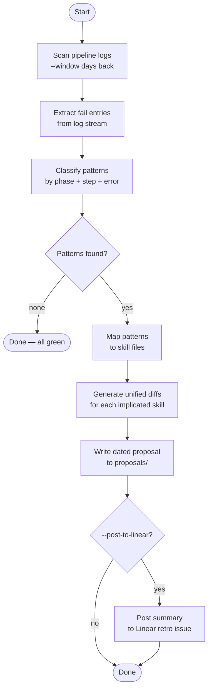

# ticket-retro

> Post-pipeline retrospection — aggregates pipeline log failures and produces a dated proposal with unified diffs for skill-file fixes.

## What it does

`ticket-retro` scans pipeline logs across a configurable time window, classifies recurring failure patterns (by phase and step), and writes a dated proposal file to `~/.claude/state/ticket-retro/proposals/` containing unified diffs that fix the implicated skill files. It never modifies skill files directly — it only writes proposals for a human to review and apply. Optionally posts a summary to a configured Linear retro issue.

## Trigger

**Slash command:** `/ticket-retro [--window Nd] [--post-to-linear]`

**Natural language:** "run retro", "retrospect the pipeline", "ticket-retro --window 14d"

## Inputs

| Input | Source | Required |
|-------|--------|----------|
| `--window` | CLI flag (default: `7d`) | No |
| `--post-to-linear` | CLI flag | No |
| Pipeline logs | `tickets/*/logs/pipeline.log` | Yes |
| `RETRO_LINEAR_ISSUE` | CLAUDE.md field | Only with `--post-to-linear` |
| `LINEAR_API_KEY` | Environment variable | Only with `--post-to-linear` |

## Outputs / Artifacts

| Artifact | Location | Description |
|----------|----------|-------------|
| Retro proposal | `~/.claude/state/ticket-retro/proposals/<date>-retro.md` | Dated report with failure patterns and unified diffs |
| Linear comment | Retro issue | Summary posted if `--post-to-linear` is set |

## How it works

## Related skills

- [`/ticket-auto`](ticket-auto.md) — generates the pipeline logs this skill reads
- [`/ticket-overseer`](ticket-overseer.md) — real-time observability; retro is retrospective
