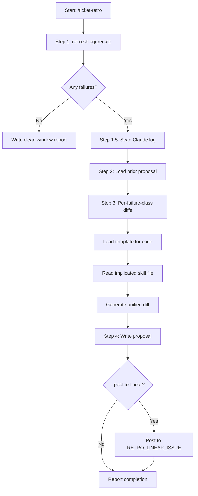

# ticket-retro

> Post-pipeline retrospection -- aggregates pipeline log failures and produces a dated proposal with unified diffs for skill-file fixes. Use when the user says "/ticket-retro", "/ticket-retro --window 7d", "run retro", or "retrospect the pipeline".

## What it does

Aggregates pipeline log failures across a configurable time window, classifies recurring patterns (gate-stops, flow errors, complexity mismatches), and generates minimal unified diffs targeting the specific skill file sections where failures originate. Also scans the Claude log for failure signals, improvement hints, and insight blocks. Writes a dated proposal to `~/.claude/state/ticket-retro/proposals/` with a failure histogram, complexity prediction accuracy table, per-failure-class pattern analysis, and apply instructions. Never modifies skill files directly.

## Trigger

**Slash command:** `/ticket-retro [--window Nd] [--post-to-linear] [--force]`

**Natural language:** run retro, retrospect the pipeline

## Inputs

| Input | Source | Required |
|-------|--------|----------|
| --window Nd | CLI (default: 7d) | No |
| --post-to-linear | CLI flag | No |
| --force | CLI flag (bypass cursor dedup) | No |
| Pipeline logs | ./logs/*-pipeline.log | Yes |
| Heartbeat logs | ./logs/*-heartbeat.log | Yes |
| RETRO_LINEAR_ISSUE | Environment variable | No |

## Outputs / Artifacts

| Artifact | Location | Description |
|----------|----------|-------------|
| Retro proposal | ~/.claude/state/ticket-retro/proposals/{date}-retro.md | Failure histogram, pattern analysis, diffs |
| Linear comment | RETRO_LINEAR_ISSUE | Summary comment (if --post-to-linear) |
| Cursor file | ~/.claude/state/ticket-retro/retro-cursor.json | Tracks last-scanned log mtimes |

## How it works

## Related skills

- [`/ticket-fleet-controller`](ticket-fleet-controller.md) -- real-time intervention (complementary to retro's post-hoc analysis)
- [`/ticket-detect-resume`](ticket-detect-resume.md) -- crash recovery from pipeline log
- [`/ticket-overseer`](ticket-overseer.md) -- human-facing pipeline dashboard
