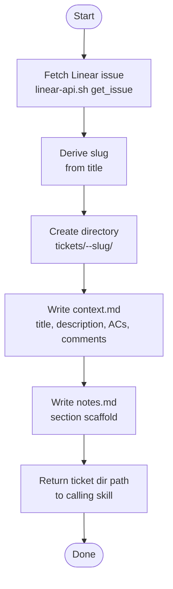

# ticket-setup

> Creates the local workspace for a Linear ticket — fetches issue data, derives the directory path, creates the directory structure, and writes context.md and a minimal notes.md.

## What it does

`ticket-setup` is the workspace scaffolding skill. It fetches the Linear issue, derives a slug from the title, creates a `<ID>--slug` directory under the tickets workspace, and writes two seed files: `context.md` (raw ticket data) and a minimal `notes.md` (ready for appraise to populate). It is called internally by `/ticket-appraise` and `/ticket-reproduce`, but can also be run directly to scaffold a workspace without starting the full appraisal.

## Trigger

**Slash command:** `/ticket-setup <TICKET-ID>`

**Natural language:** "set up workspace for WIL-42", "scaffold WIL-42" (typically called internally)

## Inputs

| Input | Source | Required |
|-------|--------|----------|
| Ticket ID | CLI argument | Yes |
| `LINEAR_API_KEY` | Environment variable | Yes |
| `ISSUE_PREFIX` | CLAUDE.md field | Yes |

## Outputs / Artifacts

| Artifact | Location | Description |
|----------|----------|-------------|
| Ticket workspace directory | `tickets/<ID>--slug/` | Created with full subdirectory structure |
| `context.md` | `tickets/<ID>--slug/` | Raw ticket: title, description, acceptance criteria, comments, labels |
| `notes.md` | `tickets/<ID>--slug/` | Minimal scaffold with section headers ready for appraise |

## How it works

## Related skills

- [`/ticket-appraise`](ticket-appraise.md) — calls this skill at Step 1
- [`/ticket-reproduce`](ticket-reproduce.md) — calls this skill to create the workspace
- [`/ticket-auto`](ticket-auto.md) — indirectly via ticket-appraise
