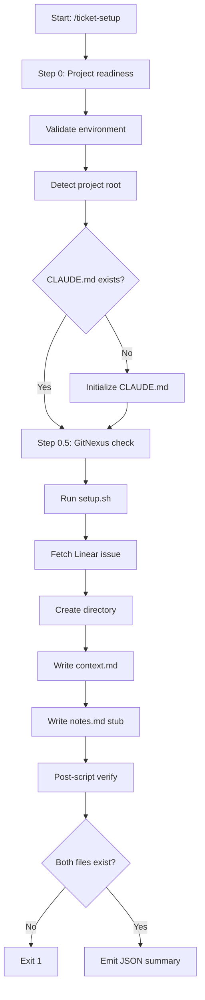

# ticket-setup

> Creates the local workspace for a Linear ticket -- fetches issue data, derives the directory path, creates the directory structure, and writes context.md and a minimal notes.md. Returns the ticket dir path and key issue fields for the calling skill to continue. Used internally by ticket-appraise and ticket-reproduce. Also callable directly if you just want to scaffold a ticket workspace.

**Private helper** -- not intended for direct invocation by end users. Called internally by [`/ticket-appraise`](ticket-appraise.md) at Step 1 and [`/ticket-reproduce`](ticket-reproduce.md) at Step 1.

## What it does

Scaffolds the local workspace for a Linear ticket. Fetches issue data, derives the directory path from ticket ID and title slug, creates the directory under the tickets root, and writes two files: `context.md` (ticket scope, labels, comments snapshot) and a minimal `notes.md` stub. Also handles project readiness checks: validates the environment, detects the project root, checks CLAUDE.md exists, and optionally bootstraps GitNexus indexing. Returns a JSON summary with ticket_dir, title, status, and other key fields for the calling skill.

## Trigger

**Slash command:** `/ticket-setup <TICKET-ID>`

**Natural language:** (called programmatically by other skills, also callable directly)

## Inputs

| Input | Source | Required |
|-------|--------|----------|
| Ticket ID | CLI argument | Yes |
| LINEAR_API_KEY | Environment variable | Yes |
| CLAUDE.md | Project root | Yes |
| --from-auto flag | CLI | No |

## Outputs / Artifacts

| Artifact | Location | Description |
|----------|----------|-------------|
| context.md | {ticket-dir}/context.md | Ticket metadata snapshot |
| notes.md | {ticket-dir}/notes.md | Minimal stub with Status and Session Log |
| Ticket directory | {tickets_root}/{ID}--{slug}/ | Full workspace directory |
| JSON summary | stdout | ticket_dir, url, title, status, project, epic, existing |

## How it works

## Related skills

- [`/ticket-appraise`](ticket-appraise.md) -- primary caller; consumes workspace for investigation
- [`/ticket-reproduce`](ticket-reproduce.md) -- secondary caller; consumes workspace for bug reproduction
- [`/ticket-env-check`](ticket-env-check.md) -- environment validation (subsumed by Step 0)
