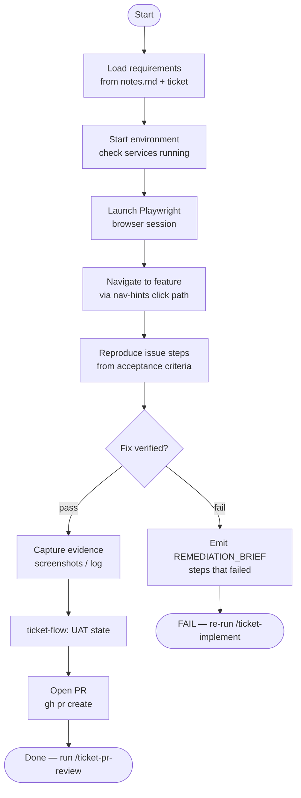

# ticket-verify

> Verifies a ticket fix by loading its requirements, navigating the live app via Playwright, and confirming the fix works. Produces a structured pass/fail report.

## What it does

`ticket-verify` performs user acceptance testing using a real browser (Playwright). It reads the ticket's acceptance criteria, navigates the target environment (local or UAT), reproduces the original issue steps, and confirms the fix resolves the problem. On failure it emits a `REMEDIATION_BRIEF` that `/ticket-implement` or a fix skill can consume directly. On pass it transitions Linear to `UAT` and triggers PR creation.

## Trigger

**Slash command:** `/ticket-verify <TICKET-ID> [--env local|uat] [--user <email>] [--password <pw>]`

**Natural language:** "verify ticket WIL-42", "test ticket WIL-42", "check if WIL-42 is fixed"

## Inputs

| Input | Source | Required |
|-------|--------|----------|
| Ticket ID | CLI argument | Yes |
| `--env` flag | CLI flag (default: `local`) | No |
| `--user` / `--password` | CLI flags | No (derived from ticket description) |
| `LOCAL_URL` / `UAT_URL` | CLAUDE.md fields | Yes |
| `LINEAR_API_KEY` | Environment variable | Yes |

## Outputs / Artifacts

| Artifact | Location | Description |
|----------|----------|-------------|
| Verify report | Logged in pipeline log | Structured PASS/FAIL with evidence |
| `REMEDIATION_BRIEF` | Emitted to stdout on FAIL | Actionable fix brief for re-implementation |
| PR | GitHub | Opened on PASS |
| Linear state | Linear issue | `UAT` (pass) or back to `In Progress` (fail) |

## How it works

## Related skills

- [`/ticket-implement`](ticket-implement.md) — produces the code this skill validates
- [`/ticket-pr-review`](ticket-pr-review.md) — next step after verification passes
- [`/ticket-reproduce`](ticket-reproduce.md) — standalone bug reproduction (no verification)
- [`/nav-hints`](nav-hints.md) — click-by-click navigation paths used during Playwright sessions
- [`/ticket-auto`](ticket-auto.md) — orchestrator that drives this skill automatically
