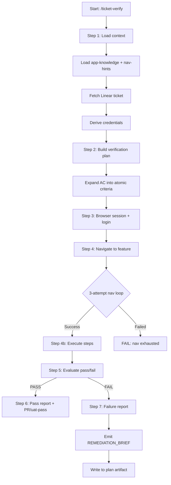

# ticket-verify

> Verifies a Linear ticket fix by loading its requirements, navigating the live app via Playwright, reproducing the original issue steps, and confirming the fix works. Produces a structured pass/fail report. On failure, emits a REMEDIATION_BRIEF that can be fed directly to ticket-implement or a fix skill. Use when the user says "/ticket-verify <ID>", "verify ticket <ID>", "test ticket <ID>", or "check if <ID> is fixed". Accepts optional --user, --password, and --env flags.

## What it does

Performs end-to-end browser verification of a ticket fix using Playwright. Loads the ticket's acceptance criteria from Linear, expands compound requirements into atomic pass criteria, derives the navigation path using nav-hints and app-knowledge (never `page.goto()` for in-app nav), logs into the app, executes click-by-click steps through the UI, evaluates each criterion, and produces a structured pass/fail report. On local pass, opens a PR and moves to Review. On UAT pass, moves to Done. On failure, emits a REMEDIATION_BRIEF with SUGGESTED_FIX, diagnostics, and context files, and writes a Verification section to the plan artifact.

## Trigger

**Slash command:** `/ticket-verify <ID> [--user <email>] [--password <pw>] [--env local|uat] [--from-auto] [--no-env-start]`

**Natural language:** verify ticket <ID>, test ticket <ID>, check if <ID> is fixed

## Inputs

| Input | Source | Required |
|-------|--------|----------|
| Ticket ID | CLI argument | Yes |
| --env | CLI (local or uat, default: local) | No |
| --user | CLI (login email override) | No |
| --password | CLI (password override, default: admin on UAT) | No |
| LINEAR_API_KEY | Environment variable | Yes |
| LOCAL_URL | CLAUDE.md | Yes (for --env local) |
| UAT_URL | CLAUDE.md | Yes (for --env uat) |
| nav-hints.md | TICKETS_ROOT | No |
| app-knowledge | Skill reference | No |

## Outputs / Artifacts

| Artifact | Location | Description |
|----------|----------|-------------|
| Verification report | stdout + Linear comment | Pass/fail with criteria table + diagnostics |
| REMEDIATION_BRIEF | stdout + plan artifact | Structured failure context for re-implementation |
| Verification #N section | Plan artifact | Persisted brief for ticket-implement to read |
| PR (local pass) | GitHub | PR created against develop |
| State transition | Linear | implement-complete, uat-pass, or uat-fail |
| Nav hint | TICKETS_ROOT/nav-hints.md | New navigation path (if discovered) |

## How it works

## Related skills

- [`/ticket-implement`](ticket-implement.md) -- produces the fix being verified; consumes REMEDIATION_BRIEF on failure
- [`/ticket-flow`](ticket-flow.md) -- state transitions (uat-pass, uat-fail, implement-complete)
- [`/nav-hints`](nav-hints.md) -- click-by-click navigation paths
- [`/app-knowledge`](app-knowledge.md) -- business rules and role-based UI behaviour
- [`/ticket-pr-review`](ticket-pr-review.md) -- PR alignment review triggered after local pass PR creation
