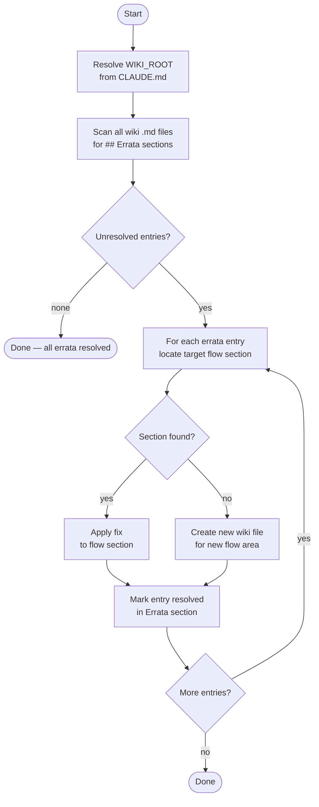

# wiki-maintenance

> Incorporates unresolved errata entries from ticket-implement feedback into wiki flow files. Reads all Errata sections, applies gap fixes to the relevant flow sections, and marks entries resolved.

## What it does

`wiki-maintenance` keeps the project's call-chain wiki files accurate by processing the errata backlog accumulated during ticket work. When `/ticket-implement` discovers that a wiki flow section is wrong or incomplete, it appends an errata entry to that flow file rather than modifying it mid-implementation. `wiki-maintenance` collects all unresolved errata, applies the fixes to the correct flow sections, and marks each entry resolved. Run when 5+ unresolved errata entries have accumulated, or on a scheduled basis.

## Trigger

**Slash command:** `/wiki-maintenance`

**Natural language:** "maintain wiki", "update wiki from errata", "incorporate errata", "fix wiki gaps"

## Inputs

| Input | Source | Required |
|-------|--------|----------|
| Errata entries | `WIKI_ROOT/**/*.md` (`## Errata` sections) | Yes |
| `WIKI_ROOT` | CLAUDE.md field | Yes |
| `$LOG_FILE` / `$HB_LOG_FILE` | Environment (set by ticket-auto) | No (only in pipeline context) |

## Outputs / Artifacts

| Artifact | Location | Description |
|----------|----------|-------------|
| Updated wiki flow files | `WIKI_ROOT/` | Errata gaps incorporated into flow sections |
| Resolved errata markers | Same wiki files | `## Errata` entries marked `[resolved]` |
| New wiki files | `WIKI_ROOT/` | Created if an errata entry references a new flow area |

## How it works

## Related skills

- [`/ticket-implement`](ticket-implement.md) — appends errata entries this skill resolves
- [`/ticket-auto`](ticket-auto.md) — can invoke this as a maintenance phase step
